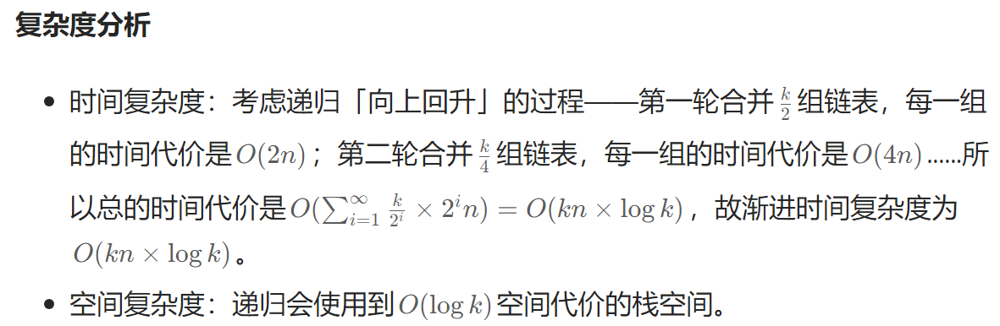

# 21.合并两个有序链表

```cpp
lass Solution {
public:
    ListNode* mergeTwoLists(ListNode* list1, ListNode* list2) {
        ListNode* head=new ListNode();
        ListNode* tempt=head;
        
        while(list1&&list2){
            if(list1->val<list2->val){
                ListNode *p=new ListNode();
                p->val=list1->val;
                tempt->next=p;
                tempt=tempt->next;
                list1=list1->next;
            }else{
                ListNode *p=new ListNode();
                p->val=list2->val;
                tempt->next=p;
                tempt=tempt->next;
                list2=list2->next;
            }
        }
        if(list1){
            tempt->next=list1;

        }
        if(list2){
            tempt->next=list2;
        }
        return head->next;
    }
};


//或者

class Solution {
public:
    ListNode* mergeTwoLists(ListNode *a, ListNode *b) {
        if ((!a) || (!b)) return a ? a : b;
        ListNode head, *tail = &head, *aPtr = a, *bPtr = b;
        while (aPtr && bPtr) {
            if (aPtr->val < bPtr->val) {
                tail->next = aPtr; aPtr = aPtr->next;
            } else {
                tail->next = bPtr; bPtr = bPtr->next;
            }
            tail = tail->next;
        }
        tail->next = (aPtr ? aPtr : bPtr);
        return head.next;
    }


```
方法一就是最常规的迭代法。新建一个tempt节点每次右移。然后每次比较后新建一个p节点接在tempt后面。然后tempt右移即可，最后把没比较完的剩余序列直接接上

方法二是简便的递归法，很妙。
```cpp
class Solution {
public:
    ListNode* mergeTwoLists(ListNode* l1, ListNode* l2) {
        if (l1 == nullptr) {
            return l2;
        } else if (l2 == nullptr) {
            return l1;
        } else if (l1->val < l2->val) {
            l1->next = mergeTwoLists(l1->next, l2);
            return l1;
        } else {
            l2->next = mergeTwoLists(l1, l2->next);
            return l2;
        }
    }
};
```

# 22.括号生成

这题又是回溯法＋递归的经典应用，注意generate函数中倒数第二步a.pop_back千万不要漏了！不可改变a字符串，因为后面的回溯需要。
```cpp
class Solution {

    bool valid(string &a){
            int balance=0;
            for(char c:a){
                if(c=='(') balance++;
                if(c==')') balance--;
                if(balance<0) return false;
            }
            if (balance==0) return true;
            else return false;
        }

    void generate(string &a,vector<string> &ans,int n){
        if(a.size()==n&&valid(a)){
            ans.push_back(a);
            return ;
        }
        if(a.size()==n&&!valid(a)) return;
        
            a+='(';
            generate(a,ans,n);
            a.pop_back();
            a+=')';
            generate(a,ans,n);
           a.pop_back();//这一步千万不要忘记，为了之后的回溯，字符串a是不可改变的！！注意
            return;
    }

public:
    vector<string> generateParenthesis(int n) {
        vector<string> ans;
        string a="";
        generate(a,ans,2*n);
        return ans;
    }
};
```

# 23.合并k个升序列表
**方法一** 使用递归法，先给出合并两个序列的函数，再依次遍历vector< ListNode*>中的每一个节点序列依次两两合并，最终时间复杂度是O(nk*K)，这是一个常规的方法。

```cpp
/**
 * Definition for singly-linked list.
 * struct ListNode {
 *     int val;
 *     ListNode *next;
 *     ListNode() : val(0), next(nullptr) {}
 *     ListNode(int x) : val(x), next(nullptr) {}
 *     ListNode(int x, ListNode *next) : val(x), next(next) {}
 * };
 */
class Solution {
public:
    ListNode* mergetwo(ListNode*head,ListNode *one){
        //ListNode* ans= new ListNode();
        if(head==nullptr){
            return one;
        }
        if(one==nullptr){
            return head;
        }
        if(head->val<one->val){
            head->next=mergetwo(head->next,one);
        }else{
            one->next=mergetwo(head,one->next);
        }

        return head->val<one->val?head:one;
        
    }

    ListNode* mergeKLists(vector<ListNode*>& lists) {
        ListNode* head = nullptr;
        //千万不可写成ListNode *head=new ListNode()!因为head必须是一个空节点！
        int n= lists.size();
        for(int i=0;i<n;i++){
            head=mergetwo(head,lists[i]);
        }
        return head;
        
    }
};
```

**方法二**用归并，mergetwo函数不变，主函数变一下，改进如下,
```cpp
ListNode* merge(vector <ListNode*> &lists, int l, int r) {
        if (l == r) return lists[l];
        if (l > r) return nullptr;
        int mid = (l + r) >> 1;
        return mergeTwoLists(merge(lists, l, mid), merge(lists, mid + 1, r));
    }

ListNode* mergeKLists(vector<ListNode*>& lists) {
        return merge(lists, 0, lists.size() - 1);
    }

```

**方法三** 优先队列，到时候再看


# 24.两两交换链表中的结点
```cpp
/**
 * Definition for singly-linked list.
 * struct ListNode {
 *     int val;
 *     ListNode *next;
 *     ListNode() : val(0), next(nullptr) {}
 *     ListNode(int x) : val(x), next(nullptr) {}
 *     ListNode(int x, ListNode *next) : val(x), next(next) {}
 * };
 */
class Solution {


public:
    ListNode* swapPairs(ListNode* head) {
        if(head==nullptr||head->next==nullptr) return head;

        ListNode* tail=new ListNode();
        tail=head->next;

        head->next = swapPairs(head->next->next);
        tail->next=head;
        return tail;
        
    }
};
```

递归啊，几步就结束了


# 25.k个一组翻转列表
一道综合的比较难的题目，不仅要熟练运用递归（这里两层递归），还要熟练链表的翻转。

```cpp
/**
 * Definition for singly-linked list.
 * struct ListNode {
 *     int val;
 *     ListNode *next;
 *     ListNode() : val(0), next(nullptr) {}
 *     ListNode(int x) : val(x), next(nullptr) {}
 *     ListNode(int x, ListNode *next) : val(x), next(next) {}
 * };
 */
class Solution {
    
    bool lastnodes(ListNode* head,int k){
        for(int i=0;i<k;i++){
            if(head==nullptr) return false;
            head=head->next;
        }
        return true;
    }

    ListNode* reversek(ListNode* head,ListNode* tail){
        ListNode* curr=head;
        ListNode* q=new ListNode();//q应该是NULL才对！只是在这道题中可以为新建空间。
        ListNode* p=new ListNode();
       
        while(curr!=tail){
            
            p=curr->next;
            curr->next=q;
            q=curr;
            curr=p;
        }
        tail->next=q;
        return tail;
    }

public:
    ListNode* reverseKGroup(ListNode* head, int k) {
        if(lastnodes(head,k)==false) return head;
        ListNode* tail=new ListNode();
        tail=head;
        for(int i=0;i<k-1;i++){
            tail=tail->next;
        }
       ListNode* nextgrouphead=tail->next;
       ListNode* newhead=reversek(head,tail);
       head->next=reverseKGroup(nextgrouphead,k);
       return newhead;
    }
};
```

# 26.删除有序数组的重复项
```cpp
class Solution {
public:
    int removeDuplicates(vector<int>& nums) {
        if (nums.empty()) return 0;  // 如果数组为空，直接返回 0

        int k = 1;  // 记录不重复元素的个数，初始为 1（第一个元素一定不重复）
        for (int i = 1; i < nums.size(); i++) {
            if (nums[i] != nums[k - 1]) {  // 如果当前元素与上一个不重复元素不同
                nums[k] = nums[i];         // 将当前元素放到 k 的位置
                k++;                       // 增加不重复元素的计数
            }
        }
        return k;  // 返回不重复元素的个数
    }
};
```