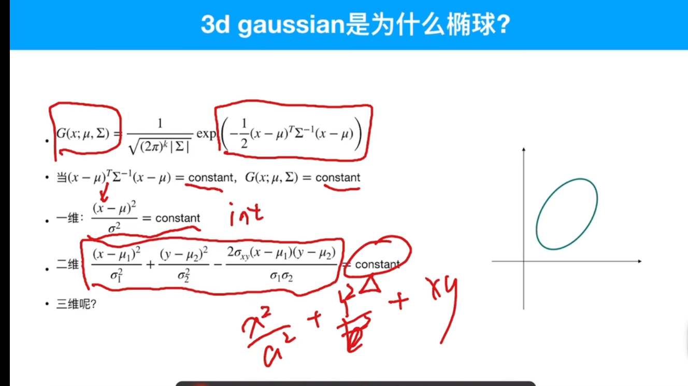
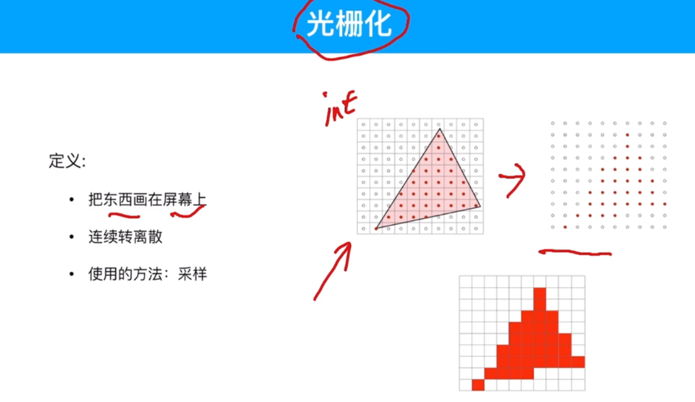
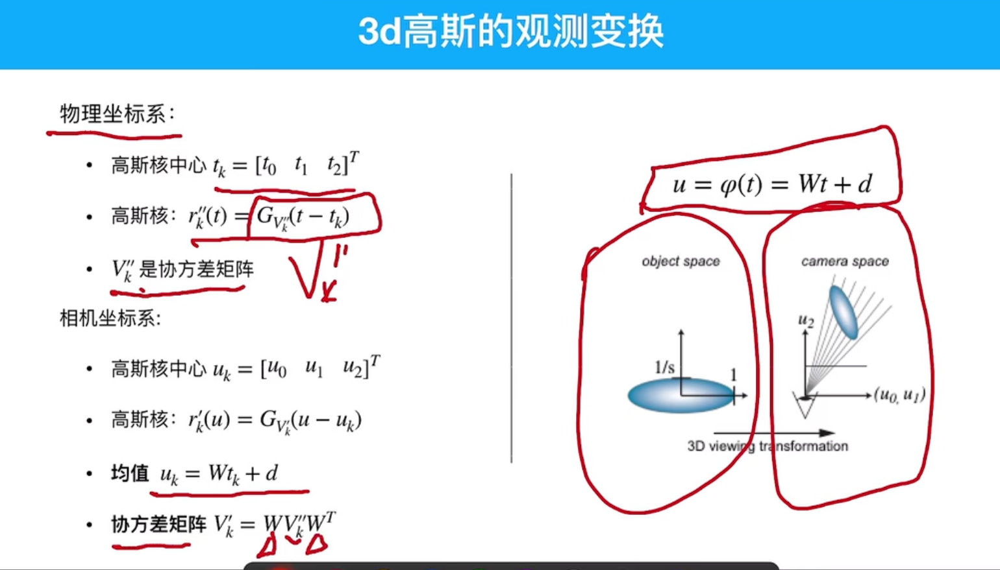
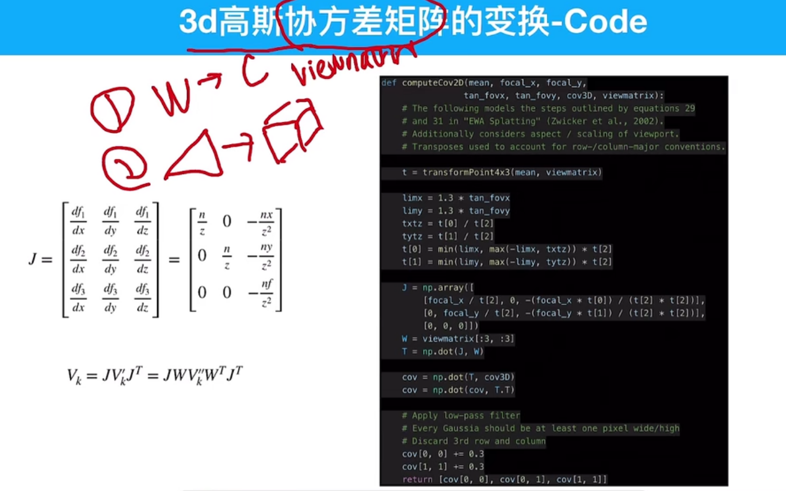

# 3DGS splatting 3D gaussian

## splatting

定义：
1. 一种体渲染的方法：从3D物体渲染到2D平面
2. Ray-casting是被动的（NeRF） 计算出每个像素点受到发光粒子的影响来生成图像
3. Splatting是主动的 计算出每个发光粒子如何影响像素点。





1. 高斯分布中，x~N(miu,lamuda),miu是均值，lamuda是协方差矩阵
2. 任意高斯可以看作是标准高斯通过仿射变换得到，球变成了椭球。
3. 新的高斯的协方差矩阵为A·lamuda·A的转置，先记着，以后再证


1. R symbolizes rotation,S symbolizes 缩放，b symbolizes 平移，所以高斯分布的仿射变换都可以看作是旋转、缩放、平移的组合，其中A可以拆成R·S.
2. 将协方差矩阵的A拆成R·S就得到论文里面的公式了
3. 已知协方差矩阵，如何求r和S?  答：通过特征值分解，
4. 
5. 

## 计算协方差矩阵(code)

将cuda转为python
```python
def computerCov3D(scale,mod,rot):
    S = np.array([
        [scale[0]*mod,0,0],
        [0,scale[1]*mod,0],
        [0,0,scale[2]*mod]
    ])
    # scale是对角矩阵的三个特征值的向量[s1,s,s3],mod是比例系数默认为1，rot是旋转矩阵。

    R = rot #R为旋转矩阵
    M=np.dot(R,S) #M为R和S的矩阵乘积
    cov3D=np.dot(M,M.T)#M.T为矩阵M的转置
    return cov3D 
```
最终返回是一个协方差矩阵。

所以，3D gaussian是椭球，协方差矩阵控制椭圆形状，协方差矩阵用旋转和缩放来表示

# 3DGS splatting 3D 到像素


## 观测变换
从世界坐标系到相机坐标系


左边的矩阵是旋转，右边的矩阵是平移



最左下方的红色方块很突兀，不连续，所以这个采样方式存在弊端。


1. eye是相机所处的位置
2. viewport是视口变换矩阵，视口变换就是从不规则长方体压缩成1×1×1的标准立方体的过程
3. MVP三步分别乘以观测矩阵和投影矩阵，get_view_matrix是观测矩阵，get_proj_matrix是投影矩阵。
4. 然后for每个点，都乘MVP矩阵进行变换，然后归一化
5. 最后两步将单位矩阵拉回原来的尺寸。





## 雅可比矩阵


雅可比矩阵是对非线性变换的一个局部的近似，局部近似后就变成了一个线性的变换


1. W是观测变换到相机变换的仿射变换矩阵
2. J是相机变换到高斯投影变换的雅可比矩阵，作用是近似，因为这个变换的压缩是非线性的


均值的变换包含视口变换，但协方差矩阵的变换没有视口变换


n是前面的底边距离眼睛的距离，f是后面的底边距离眼睛的距离。


视口变换与协方差矩阵无关


1. 注意p_orto已经完成了view×proj，即完成了观测变换和投影变换。
2. p_proj 是视口变换，拉成一个一乘一乘一的立方体，点位于立方体内
3. 光栅化，最后一步point_image是从NDC平面拉到像素平面


1. 从世界坐标到相机坐标系
2. 从视锥变换成立方体，雅可比矩阵完成


1. 补上笔记2.23:27


# 3DGS 颜色


# 3DGS 足迹合成


# 机器学习与参数评估
