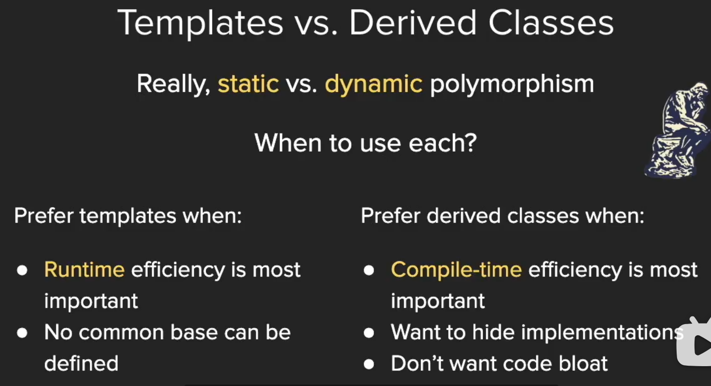

# **CS106l**

## **写在前面的话**
首先是课程网址，[cs106l](https://web.stanford.edu/class/cs106l/)

其次是[cpp.reference网站](https://en.cppreference.com/w/)
记得挂梯子哦

## lecture1：beginning  

###  for the std
std and < bits/stdc++.h >
the CSDN web is here,[click this](https://blog.csdn.net/ULTRAmanTAROACE/article/details/138307399?ops_request_misc=%257B%2522request%255Fid%2522%253A%252241d96b6941c1ef62f78b4ff19c918118%2522%252C%2522scm%2522%253A%252220140713.130102334..%2522%257D&request_id=41d96b6941c1ef62f78b4ff19c918118&biz_id=0&utm_medium=distribute.pc_search_result.none-task-blog-2~all~top_positive~default-1-138307399-null-null.142^v101^pc_search_result_base9&utm_term=std&spm=1018.2226.3001.4187)


### Find the sum of a vector
```c
//version 1
vector<int> vec ={1,2,3};
int sum =0;
for(auto val :vec){
    sum +=val;
}

//version 2
vector<int> vec={1,2,3};
int sum=0;
for(const auto&val  :vec){
    sum +=val;
}

//version 3
vector<int> vec={1,2,3};
int sum= std::accummulate(vec.begin(),vec.end(),0);
```

### Hello world!
```c
#include<iostream>
int hello_cpp(){
    std::cout<<"hello world!"<<std::endl;
}

#include<stdio.h>
#include<stdlib.h>
int hello_c(){
    printf("%s","hello world!");
}
//two versions are equal
```

## lecture 2

### string
```c
int main(){
    string str="Hello world!";
    cout::str::endl;//print the string
    cout::str[1]::endl;//print "e"
    str[1]='i';//change the char

}
```

### stream
输出流
```cpp
int main(){
    ostringstream oss("Ito-En Green Tea");
    cout << oss.str()<< endl;//Tto-En Green Tea;
    oss << "16,9 Ounces";//16.9 Ouncesn Tea
    //这个流是从左开始做buffer进行替换的
    
    ostringstream oss("Ito-En Green Tea",ostringstream::ate);
    cout << oss.str()<< endl;//Tto-En Green Tea;
    oss << "16,9 Ounces";//
    //这个流是从右开始做buffer进行替换的

    isstringstream iss("16.9 Ounces");
    double amount;
    string unit;
    iss >> amount;//amount get 16.9 as a double
    iss >> unit;
    cout << amount/2 << endl; //8.45?

    isstringstream iss("16.9 Ounces");
    int amount;
    string unit;
    iss >> amount;
    iss >> unit;//this two lines can be combined as iss >> amount >> unit
    cout << amount/2 << " " << unit << endl; //8 .9 
    //一个指针从头开始往右移动，first stop at 6,and amount gets 16, then a bubble, then unit gets .9,so the result outputs 8 .9

}
```

 string to integer
```cpp
int stringToInteger(const string& s){
    istringstream iss(s);
    int result;
    iss >> result;

    return result;
}
```

we can use manipulators to pad the output.
```cpp
cout << "[" << setw(10) << "Ito" << "]";
//output:[          Ito]
cout << "[" << left << setw(10) << "Ito" <<  "]";
//output:[Ito          ]
cout << "[" << left << setfill('-') << setw(10) << "Ito" << "]";
//output:[Ito----------]
```

## lecture 3: type and advanced streams
### cin and cout
```cpp
cout << "What is your name?";
cin >> name;
getline(cin,name);
```

```cpp
int getInteger(const string& prompt){
    string line;
    getline(cin,line);

    istringstream iss(line);
    int val;
    iss >> val;
}
```

### auto
automatically help you be lazy

```cpp
auto prices = make_pair(3.4,5); //pair<double,int>
auto values = make_tuple(3,4,"hi"); //tuple<int,int,char*>

prices.first = prices.second; //prices = {5.0,5};
get<0>(values) = get<1>(values); //values = {4,4,"hi"};

auto [a,b] = prices; //a,b are copies of 5.0 and 5;
const auto& [x,y,z]=values; //x,y,z are const references to the 4,4, and "hi";
```

## lecture 4: sequence container
review the structure first
```cpp
struct PriceRange{
    int min;
    int max;
}

struct Course{
    string code;
    Time startTime;
    Time endTime;
    vector<string>instructors;
}
```

initialization
```cpp
int main(){
    vector<int> vec{3,1,4,1,5,9};
    Course now{"CS106L",{15,30},{16,30},{"Wang","Zeng"}};
}
```
```cpp
int main(){
    vector<int> vec1{3}; // vector = {3}
    vector<int> vec2(3); // vector = {0,0,0}
}
```

**caution:Use Thoughtfully**
When should I use a stringstream?
1. Proccessing strings
   1. simplify "/./a/b/.."to"/a"
2. Formatting input/output
   1. ippercase,hex,and other stream manipulators
3. Parsing different types
   1. stringToLinteger() from previous lectures

### STL库
example of the bubble sort
the usual type is here:
```cpp
int main(){
    vector<int> vec(20);
    for(size_t i=0;i< vec.size(); i++){
        vec[i]=rand();
    }

    doBubbleSort(vec);

    for(size_t i=0;i<vec.size();i++){
        cout << vec[i]  << endl;
    }
}

void doBubbleSort(vector<int> &v){
    for(size_t i=0;i<v.size()-1;i++){
        for(size_t j=0;j<size(()-i-1;j++){
            if(v[j]>v[j+1]){
                int temp =v[j];
                v[j]=v[j+1];
                v[j+1]=tmp;
            }
        }
    }
}
```

the STL type is here:
```cpp
int main(){
    vector<int> vec(20);
    std::generate(vec.begin(),vec.end(),rand);
    std::sort(vec.begin(),vec.end());
    std::copy(vec.begin(),vec.end(),std::ostream_iterator<int>(cout,"\n"));
}
```

### sequence container
provides access to sequences of elements
includes:
std::vector < T >
std::dequet < T >
std::list < T >
std::array < T >
std::forward_list < T >

#### std::vector< T >
a vector represents a sequence of elements of any type.You specify the type when using the vector:
```cpp
std::vector< int > vecInt;//vector of ints
std::vector< string > vecStr;//vector of string
std::vector< mystruct > vecStruct;//vector of mystructs
std::vector< std::vector< string > > vecOfVec // vector of vector<string>
```

summary of Stanford vector< t > vs std::vector< T >


#### std::deque< T >

cpp reference explain deque ,[click here](https://en.cppreference.com/w/cpp/container/deque)

```cpp
#include <deque>
#include <iostream>
 
int main()
{
    // Create a deque containing integers
    std::deque<int> d = {7, 5, 16, 8};
 
    // Add an integer to the beginning and end of the deque
    d.push_front(13);
    d.push_back(25);
 
    // Iterate and print values of deque
    for (int n : d)
        std::cout << n << ' ';
    std::cout << '\n';
}
```
```
output : 13 7 5 16 8 25
```

vector is the type of sequence that should be used ***by default***...deque is the data structrue of choice when most insertions and deletions take place ***at the beginning or at the end of sequence***.


in general,a graph could tell the difference between the vector and the deque


#### the stack and the queue

*so the stack and the queue are just a special case of the vector and the deque.*

## lecture5: Associative Container
 have no idea of a sequence.
 data is accessed using the key instead of indexes.
 includes:
 ```cpp
 std::map< T1,T2 >
 std::set< T >
 std::unordered_map< T1,T2 >
 std::unoedered_set< T >
 ```
 map/set:Keys in sorted order,faster to iterate through a range of elements.
 
 
 Unordered map/set:faster to access individual elements by key.


### iterator
在 C++ 中，迭代器是一种检查容器内元素并遍历容器的对象。迭代器可以被视为指向容器中元素的指针。它们提供了一种方式来访问容器中的数据，而不需要暴露容器的内部结构。C++ 标准库中的所有容器类型（如 vector, list, map, set 等）都提供了迭代器。

以下是关于 C++ 迭代器的一些基本概念：

#### 迭代器的类型

**输入迭代器:** 提供了对数据的只读访问。可以用来读取数据，但不能用来修改数据。例如，流迭代器就是输入迭代器。
**输出迭代器:** 提供了对数据的只写访问。可以用来修改数据，但不能用来读取数据。
**前向迭代器:** 提供了读写操作，并且可以向前推进迭代器。但是，它不支持后退操作。
**双向迭代器:** 除了前向迭代器的功能外，还支持向后移动迭代器。
**随机访问迭代器:** 提供了完全的读写操作，可以向前向后移动，并且支持跳跃访问（如通过索引访问）。

#### 迭代器的基本操作

**begin()：** 返回指向容器第一个元素的迭代器。
**end()：** 返回指向容器最后一个元素之后位置的迭代器，通常用于标记迭代器的结束。
**++：** 用来推进迭代器到下一个元素。
*：用来解引用迭代器，访问它所指向的元素。
**== 和 !=：** 用来比较两个迭代器是否相等或不相等。

示例
以下是一个使用迭代器遍历 vector 的简单示例：
```cpp
#include <iostream>
#include <vector>

int main() {
    std::vector<int> vec = {1, 2, 3, 4, 5};

    // 使用迭代器遍历 vector
    for (std::vector<int>::iterator it = vec.begin(); it != vec.end(); ++it) {
        std::cout << *it << ' ';
    }
    std::cout << '\n';

    return 0;
}
```
在这个例子中，我们使用了 vector 的迭代器来遍历并打印容器中的每个元素。

C++11 范围基于的 for 循环
C++11 引入了基于范围的 for 循环，它可以简化迭代器的使用：
```cpp
for (int elem : vec) {
    std::cout << elem << ' ';
}
```
这个循环会自动为每个元素创建一个迭代器，并遍历整个容器。

迭代器是 C++ 标准库中非常核心的概念，它们使得算法和容器可以独立开来，提供了更高的抽象层次和代码复用性。

## lecture 6:advanced iterators and containers

### review of the iterator

four essential iterator operations:

**Create iterator**:
```cpp
std::set<int>::iterator iter = mySet.begin();
```
**Dereference iterator to read value currently pointed to:**
```cpp
int val = *iter;
```

**Advance iterator：**
```cpp
iter++; or ++iter;
```

**Compare against another iterator(especially .end() iterator):**
```cpp
if(iter == myset.end()) return;
```

### pair class

A pair is simply two objects bundled together.

syntax:
```cpp
std::pair<string,int>p;
p.first ="phone number";
p.second = 6507232300;
```

quicker ways to make a pair:
```cpp
std::pair<string,int> p{"phone number",6507232300};
std::make_pair("phone number",6507232300);
```

### map iterators

example:
```cpp
map<int,int> m;
map<int,int>::iterator i = m.begin();
map<int,int>::iterator end = m.end();
while(i != end){
    cout << (*i).first << (*i).second << endl;
    i++;
}
```

### further iterator usage

example:
```cpp
map<string,int> MyMap;
MyMap = readuserwords();//this function is already got.

for(auto [key,val] : MyMap){
    cout << key << "," <<  val << endl;
}

//the same 

for(auto elem : Mymap){
    cout << elem.first << "," << elem.second << endl;
}
```

example:
```cpp
#include<vector>

using std::vector;

void printVec(const vector<int> &vec){
    for (auto elem: vec){
        cout<< elem << " ";
    }
    cout << endl;
}

int main(){
    //sorting a vector
    vector <int> vec{3,1,4,1,5,9,2,6};
    
    printVec(vec);
    std::sort(vec.begin(),vec.end());
    //if we want to sort the first 4 ones, we can also use "std::sort(vec.begin(),vec.begin()+4);
    printVec(vec);

    set<int> elems{3,1,4,1,5,9,2,6};
    cout << elems.size() << endl;

    //finding an element from a set
    auto testit=std::find(elem.begin(),elems.end(),5);
    if(testit ==elems.end()){//if not found, the point will continue to move to the last one in elems.
        cout << "Not Found" << endl;
    }else{
        cout << "Found: "<< testit << endl;
    }

    set<int>::iterator iter = elems.lower_bound(4);
    set<int>::iterator end = elems.upper_bound(6);
    cout << "start: " << *iter << ", end: " << *end << endl;

    for(; iter != end; ++iter){
        cout << *iter << " ";
    }
    cout << endl;

    return 0;
}
```
**notice:** elems.end() is outside the elems!!!

use the graphs in ppt:


### < template T>
```cpp
template <typename T>
pair <T,T> my_minmax(T a,T b){
    if(a<b) return {a,b};
    else return {b,a};
}
```
这段代码是一个C++模板函数，它的作用是返回两个给定参数a和b中的最小值和最大值组成的pair。下面我将详细解释这个函数的各个部分：

模板声明: 
```cpp
template <typename T>
```
这行代码声明了一个模板，T是一个占位符类型，它在函数被调用时会被实际传递给函数的参数类型所替换。这意味着my_minmax函数可以接受任何类型的参数，只要这两个参数的类型相同。

```cpp
函数返回类型:
pair <T,T>
```
pair是C++标准库中的一个模板类，用于将两个值组合成一个单元。这里pair<T,T>表示这个单元中的两个值都是同一种类型T。
```cpp
函数定义:
my_minmax(T a, T b)
```
这是函数的名称和参数列表。my_minmax接受两个参数a和b，它们的类型都是T。
```cpp
函数体:
if(a < b) return {a, b};
else return {b, a};
函数体包含一个简单的条件判断：
如果a小于b，那么a是最小值，b是最大值，函数返回一个包含a和b的pair。
如果a不小于b（即a大于或等于b），那么b是最小值，a是最大值，函数返回一个包含b和a的pair。
```
这个函数通过比较两个参数的大小，然后以pair的形式返回最小值和最大值，从而实现了其功能。由于使用了模板，这个函数可以用于任何可以比较大小关系的类型，例如整数、浮点数、字符等。

使用示例：
```cpp
int main() {
    auto result = my_minmax(10, 20); // result will be pair(10, 20)
    // To access the minimum and maximum values:
    int min = result.first;  // min will be 10
    int max = result.second; // max will be 20
    return 0;
}
在这个例子中，my_minmax函数被调用来比较两个整数10和20，并返回一个pair，其中包含最小值10和最大值20。
```
### template function

A template function defines an implicit interface that each template parameter must satisfy.

```cpp
template <typename InputIterator, typename Datatype>
int countOccurences(InputIterator begin,InputIterator end,Datatype val){
    int count= 0;
    for (auto iter = begin;iter != end;iter++){
        if(*iter == yal) ++count;
    }
    return count;
}
```


## lecture7-8：Function and algorithm

### lambda
```cpp
int main(){
    int limit = getInterger("Minimum for A");
    vector<int> grades = readStudentGrades();
    auto func =[limit] (auto val) {return val >= limit;};
    CountOccurences(grades.begin(),grades.end(),func)
}
```

#### Anatomy of a lambda function

```cpp
auto func = [capture-clause](parameters){
    //body
};
```

#### An example

Lambda 表达式（通常简称为 "lambda"）是许多现代编程语言中的一个特性，它允许开发者编写内联的匿名函数，即不需要明确指定函数名的函数。Lambda 表达式在语法上更简洁，并且可以在需要函数对象的任何地方使用。以下是关于 lambda 表达式的原理、作用和一些关键点的解释：

原理

Lambda 表达式的原理基于几个概念：

闭包（Closure）：Lambda 表达式可以捕获其周围作用域中的变量，即使这些变量在 lambda 表达式被定义后已经超出了作用域。这种能力称为闭包。
匿名函数：Lambda 表达式是匿名的，这意味着它们没有名字。它们通常是在需要的地方直接定义和使用的。

表达式：Lambda 表达式通常是一个表达式，它可以被赋值给变量，作为参数传递，或者直接调用。

作用

Lambda 表达式在编程中有多种用途：

简化和内联代码：Lambda 允许你在需要函数的地方直接编写函数逻辑，减少了代码的复杂性。

事件处理：在 GUI 编程中，lambda 表达式常用于为按钮点击等事件指定处理函数。

数据处理：在处理集合（如列表、数组）时，lambda 可以用作过滤、映射或排序的回调函数。

并发编程：在多线程编程中，lambda 可以用作线程执行的函数。

自定义行为：在标准库算法中，lambda 允许你自定义比较或操作行为。

示例
以下是一个 C++ 中的 lambda 表达式示例：
```cpp
#include <iostream>
#include <vector>
#include <algorithm>
int main() {
    std::vector<int> numbers = {1, 2, 3, 4, 5};
    // 使用 lambda 表达式来打印所有元素
    std::for_each(numbers.begin(), numbers.end(), [](int x) {
        std::cout << x << " ";
    });
    std::cout << std::endl;
    // 使用 lambda 表达式来查找第一个偶数
    auto it = std::find_if(numbers.begin(), numbers.end(), [](int x) {
        return x % 2 == 0;
    });
    if (it != numbers.end()) {
        std::cout << "第一个偶数是: " << *it << std::endl;
    }
    return 0;
}
```
在这个例子中，
```cpp
[](int x) { std::cout << x << " "; } 是一个 lambda 表达式，它被传递给 std::for_each 算法，用于打印 numbers 向量中的每个元素。另一个 lambda 表达式 [](int x) { return x % 2 == 0; } 被传递给 std::find_if 算法，用于查找第一个偶数。
```
关键点
捕获列表：Lambda 表达式可以有一个捕获列表，它指定了如何捕获外部作用域中的变量。捕获可以是值捕获、引用捕获或隐式捕获。
参数列表：Lambda 表达式可以有参数，就像普通函数一样。
返回类型：Lambda 表达式的返回类型可以省略，编译器会根据返回语句推断返回类型。如果需要显式指定返回类型，可以在参数列表后面加上 -> 类型。
Lambda 表达式是现代编程语言中一个强大的特性，它提高了代码的灵活性和表达力。


#### capture by value(=) or by reference(&)

```cpp
//capture all by value, except teas is by reference
auto func1 = [=,&teas](parameters)-> return-value{
    //body
};
```
```cpp
//capture all by referene, except banned is by value
auto func2 = [&,banned](parameters)-> return-value{
    //body
};
```


### a nice example:further insight of lambda
```cpp
int limit = 5;
auto  isLessThanLimit =[limit] (auto val)->bool{
    return val < limit;
}
```
可以缩写成以下形式：（去掉bool）；
```cpp
int limit = 5;
auto  isLessThanLimit =[limit] (auto val){
    return val < limit;
}
```
如果我们想找一个变量依次递增，传入其地址：
```cpp
int limit = 5;
int num_times_called = 0;
auto  isLessThanLimit =[limit,&num_times_called] (auto val){
    ++num_times_called;
    return val < limit;
}
```

### 迭代器、一元谓词函数、lambda表达式的一个例子

在 C++ 中，`template<typename InputIt, typename UnaryPred>` 是一个模板声明，它用于定义一个模板函数或模板类，这个模板可以接受两个模板参数：
1. `InputIt`：这个参数通常用于指定输入迭代器的类型。输入迭代器是一种能够用于读取序列中元素的迭代器类型。它们必须支持至少一次的递增操作（以访问序列中的下一个元素）以及解引用操作（以访问迭代器所指向的元素）。
2. `UnaryPred`：这个参数用于指定一个一元谓词函数的类型。一元谓词是一个可调用的表达式，它接受一个参数并返回一个可以解释为布尔值的值（通常是 `bool` 类型）。在算法中，一元谓词通常用于指定一个条件，算法可以根据这个条件来测试序列中的元素。
以下是一个使用这两个模板参数的函数模板示例，该函数用于计算满足给定谓词条件的元素数量：
```cpp
template<typename InputIt, typename UnaryPred>
typename std::iterator_traits<InputIt>::difference_type
count_if(InputIt first, InputIt last, UnaryPred pred) {
    typename std::iterator_traits<InputIt>::difference_type count = 0;
    for (; first != last; ++first) {
        if (pred(*first)) {
            ++count;
        }
    }
    return count;
}
```
在这个示例中：
- `InputIt` 是输入迭代器的类型，比如 `std::vector<int>::iterator`。
- `UnaryPred` 是一元谓词的类型，比如一个 lambda 表达式或者一个函数指针。
- `std::iterator_traits<InputIt>::difference_type` 是一个类型，它能够表示两个迭代器之间的距离，通常用于计数。
这个 `count_if` 函数模板接受一个范围 `[first, last)` 和一个谓词 `pred`，然后遍历这个范围，对每个元素应用谓词。如果谓词返回 `true`，则增加计数。
使用这个模板函数的一个例子：
```cpp
#include <vector>
#include <iostream>
int main() {
    std::vector<int> vec = {1, 2, 3, 4, 5, 6, 7, 8, 9};
    
    // 使用 lambda 表达式作为一元谓词，计算偶数的数量
    auto even_count = count_if(vec.begin(), vec.end(), [](int x) { return x % 2 == 0; });
    
    std::cout << "Number of even elements: " << even_count << std::endl;
    
    return 0;
}
```
在这个例子中，`count_if` 函数模板被用来计算 `vec` 中偶数的数量。Lambda 表达式 `[](int x) { return x % 2 == 0; }` 作为一元谓词，检查一个整数是否为偶数。


### algorithm

#### remove

std::remove does not change the size of the container!
The algorithm is not a member o std::vector(or any other collection) so it can't change its size member.

erase-remove idiom
```cpp
v.erase(std::remove_if(
    v.begin(),v.end(),pred),
    v.end()
);
```
这段代码是C++中用于移除容器`v`中满足特定条件（由函数对象`pred`指定）的元素的常见模式。这里是分步解释：
1. `std::remove_if`是一个算法，它接受三个参数：开始迭代器`v.begin()`，结束迭代器`v.end()`，和一个谓词函数`pred`。谓词`pred`是一个可以调用的对象（比如函数、函数指针或者重载了`operator()`的类对象），它接受容器的元素作为参数，并返回一个布尔值。
2. `std::remove_if`算法会遍历指定范围内的元素，并将不满足谓词`pred`（即`pred(element)`返回`false`）的元素移动到序列的前面。算法返回一个迭代器，指向最后一个不被移除元素的下一个位置。
3. `v.erase`是一个成员函数，它用于从容器中删除元素。这里它接受两个参数：第一个参数是`std::remove_if`返回的迭代器，它指向第一个应该被移除的元素；第二个参数是容器的结束迭代器`v.end()`。
所以，整个表达式`v.erase(std::remove_if(v.begin(), v.end(), pred), v.end())`的工作流程如下：
- 使用`std::remove_if`找出所有需要移除的元素，并将不需要移除的元素移动到容器的前面。
- 使用`v.erase`删除那些被移动到容器末尾的元素。
最终的结果是，容器`v`中所有满足谓词`pred`的元素都被移除了，容器的大小也相应地减小了。需要注意的是，`std::remove_if`并不实际删除元素，它只是将不需要删除的元素移动到序列的前面，并返回一个新逻辑末尾的迭代器。实际的删除操作是由`erase`方法完成的。

## lecture9: STL summary


### 文件读取 ifstream

`ifstream` 是 C++ 中用于输入文件流的类，它是从 `fstream` 类派生而来的，用于从文件读取数据。以下是 `ifstream` 的基本用法：

 1. 包含头文件
首先，你需要包含 `<fstream>` 头文件，这是使用 `ifstream` 的前提。
```cpp
#include <fstream>
```
 2. 创建 `ifstream` 对象
你可以创建一个 `ifstream` 对象来打开一个文件。
```cpp
ifstream inputFile("example.txt");
```
 
 3. 检查文件是否成功打开
在使用文件流之前，应当检查文件是否成功打开。
```cpp
if (!inputFile.is_open()) {
    cerr << "无法打开文件！" << endl;
    return -1; // 或者其他错误处理
}
```
  4. 读取文件内容
你可以使用多种方法来读取文件内容，以下是一些常用的方法：
   
   使用 `>>` 运算符
```cpp
string line;
while (inputFile >> line) {
    cout << line << endl;
}
```

使用 `getline()` 函数
```cpp
string line;
while (getline(inputFile, line)) {
    cout << line << endl;
}
```

读取字符
```cpp
char c;
while (inputFile.get(c)) {
    cout << c;
}
```

 1. 关闭文件
当你完成文件操作后，应当关闭文件。
```cpp
inputFile.close();
```

 完整示例
以下是一个简单的示例，展示了如何使用 `ifstream` 读取一个文本文件的内容。
```cpp
#include <iostream>
#include <fstream>
#include <string>
using namespace std;
int main() {
    ifstream inputFile("example.txt");
    if (!inputFile.is_open()) {
        cerr << "无法打开文件！" << endl;
        return -1;
    }
    string line;
    while (getline(inputFile, line)) {
        cout << line << endl;
    }
    inputFile.close();
    return 0;
}
```

在这个示例中，程序尝试打开名为 "example.txt" 的文件，并逐行读取内容，然后输出到标准输出。最后，关闭文件流。
在使用文件流时，应当注意异常处理和资源管理，比如使用 C++ RAII 特性确保文件在退出作用域时能够被正确关闭。在现代 C++ 中，推荐使用 `std::ifstream` 的 RAII 特性，这样你就不需要显式调用 `close()` 方法。

## lecture 10:Classes and const correctness

### count a string in another string

```cpp
int countOccurences(const string &word ,const string & text ){
    string tofind =" "+word+" ";

    //std::search
    auto curr = text.begin();
    auto end = text.end();
    int count = 0;

    while( curr!=end){
        auto found = std::search(curr,end,word.begin(),word.end());

        if(found==end)break;

        ++count;
        curr=find+1;//the correct step may be "curr=find+word.size()";
        
    }
    return count;
}
```

#### std::search
`std::search` 是 C++ 标准库中的一个算法，用于在给定范围内查找子序列。它定义在 `<algorithm>` 头文件中。以下是 `std::search` 的基本用法和它在这段代码中的作用：
**基本用法：**
```cpp
template <class ForwardIterator1, class ForwardIterator2>
ForwardIterator1 search(ForwardIterator1 first1, ForwardIterator1 last1,
                       ForwardIterator2 first2, ForwardIterator2 last2);
```
`std::search` 接受四个迭代器参数：
- `first1` 和 `last1` 定义了要搜索的范围（即主序列）。
- `first2` 和 `last2` 定义了要查找的子序列。
函数返回一个迭代器，指向在主序列中找到子序列的第一个元素，如果没有找到子序列，则返回 `last1`。
**在代码中的作用：**
在提供的代码段中，`std::search` 被用于在文本 `text` 中查找单词 `word`：
```cpp
auto found = std::search(curr, end, word.begin(), word.end());
```
这里：
- `curr` 是当前搜索开始的位置，初始时指向 `text` 的开始。
- `end` 是 `text` 的结束迭代器。
- `word.begin()` 和 `word.end()` 分别是单词 `word` 的开始和结束迭代器。
`std::search` 将从 `curr` 开始在 `text` 中查找 `word` 的序列。如果找到了 `word`，`found` 将指向 `text` 中 `word` 的开始位置；如果没有找到，`found` 将等于 `end`。
在循环中，每次找到 `word` 后，`curr` 应该更新为 `found` 之后的位置，以便继续在剩余的文本中查找 `word`。但是，如之前提到的，代码中的 `curr = found + 1;` 是错误的，因为它只前进了一个字符而不是整个单词的长度。正确的更新应该是 `curr = found + word.size();`。
`std::search` 使用的是默认的相等比较操作，即 `operator==`。如果需要不同的比较方式，可以传递一个额外的比较函数或对象给 `std::search`。

### 求向量点积

```cpp
int dotProduct(const vector<int>& vec1, const vector<int> & vec2){
    return std::inner_product(vec1.begin(),vec1.end(),vec2.begin(),0);
}

```
### const

#### a const pointer

using pointers with const is a little tricky

when in doubt,read right to left

```cpp
//constantcpointer to a non-constant int
int * const p;

//non-constnt pointer to a constant int
const int *p;
int const *p;

//constant pointer to a constant int
const int *const p;
int const * const p;
```

#### const iterators

```cpp
const vector<int>::iterator itr = v.begin();
*itr = 5; //ok! changing what itr points to
++itr; //bad! can't modify itr

vector<int>::const_iterator itr = v.begin();
*itr = 5; //bad! can't change value of itr
++itr; //ok! changing v
int value = *itr; //ok! reading from itr
```

#### challenge mode

```cpp
const int* const myClassMethod(const int * const & param) const;
```

这个函数声明包含了多个 `const` 关键字，每个都扮演着不同的角色。下面是对每个 `const` 的解释：

1. `const int* const`：
   - 第一个 `const` 表示返回类型是一个指向常量整数的指针。这意味着通过返回的指针不能修改指向的整数值。
   - 第二个 `const` 表示返回的指针本身是一个常量指针，这意味着不能更改指针的地址，即返回的指针值不能被赋给其他指针变量。

2. `myClassMethod`：
   - 这是函数的名称。

3. `(const int * const & param)`：
   - 第一个 `const` 表示参数 `param` 是一个指向常量整数的指针，意味着在函数内部不能通过 `param` 指针修改它所指向的值。
   - 第二个 `const` 表示 `param` 本身是一个常量指针，但在这里与引用结合使用时，它表示引用的是一个常量指针，即不能通过引用改变 `param` 的值。
   - `&` 表示参数是通过引用传递的，这意味着传递的是参数的别名，而不是参数的副本。虽然引用本身不允许改变，但由于 `param` 是一个指向常量的指针的引用，因此你也不能通过引用来改变指针的值。

4. 最后一个 `const`：
   - 这个 `const` 出现在函数声明的末尾，表示这个成员函数是常量成员函数。这意味着在函数体内不能修改类的任何非静态成员变量，并且不能调用类中任何非 `const` 成员函数。
综上所述，这个函数声明表明 `myClassMethod` 是一个常量成员函数，它接受一个指向常量整数的常量指针的引用作为参数，并返回一个指向常量整数的常量指针。在整个函数调用过程中，通过指针或引用都不能修改传递的整数值，也不能修改指针或引用本身。返回的指针也不能用于修改指向的数据，且返回的指针值本身不能被更改。


## lecture11:operator overlap

### +=
```cpp
vector<string> & vector<string>::operator+=(const int& element){
    push_back(element);
    return *this;
}

vector<string>& vector<string>::operator+=(const vector<int>& other){
    for(int val : other) push_back(val);
    return *this;
}
```

### +

```cpp
vector<string> operator+(const vector<string>& vec,const string& element){
    vector<string> copy = vec;
    copy+= element;
    return copy;
}

vector<string> operator+(const vector<string>& lhs,const vector<string>& rhs){
    vector<string> copy = lhs;
    copy += rhs;
    return copy;
}
```

### []
```cpp
string& vector<string>::operator[](size_t index){
    return _elems[index];
}

const string& vector<string>::operator[](size_t index) const{
    return _elems[index];
}
```
在成员函数的声明中，最后的`const`关键字是用来指明该函数不会修改调用它的对象。这个`const`是函数签名的一部分，称为成员函数的常量性(constness)。以下是关于这个`const`关键字的详细解释和如果省略它会发生什么：

**`const`关键字的作用**

在函数`const string& vector<string>::operator[](size_t index) const`中，最后的`const`表明：
- 这个函数承诺不会修改调用它的对象的状态（即，不会修改对象的任何成员变量）。
- 这个函数可以被一个const对象调用。

**如果省略`const`会发生什么**
如果省略了最后的`const`，函数声明将变为：

```cpp
const string& vector<string>::operator[](size_t index){
    return _elems[index];
}
```
以下是省略`const`后会发生的情况：
1. **不能通过const对象调用**：如果一个`vector<string>`对象被声明为const，你将无法使用这个没有`const`的`operator[]`来访问它的元素，因为const对象只能调用const成员函数。
```cpp
const vector<string> vec = {"apple", "banana", "cherry"};
string fruit = vec[0]; // 错误：不能调用非const operator[]通过const对象
```
2. **可能会修改对象**：没有`const`修饰的成员函数可能会修改对象的成员变量，这违反了const对象的不变性原则。虽然在这个特定的例子中，函数返回的是成员数组的引用，并且函数体本身没有修改任何东西，但是省略`const`会允许未来对函数的实现进行修改，从而可能会不小心违反const的承诺。
3. **代码意图不明确**：省略`const`可能会让其他开发者误解函数的意图，认为函数可能会修改对象的状态。
总之，省略最后的`const`会限制函数的使用范围，并可能导致代码的意图不明确。在C++中，正确使用`const`是编写清晰、安全代码的重要部分。


**general rule of thumb:member vs non-member**

if binary operator and treats both operands equally(eg.both unchanged) implement as non-member(maybe friend).Examples:+,<.

if binary operator and not both equally(changes lhs),implement as member (allows easy access to lhs private members).Examples:+=.

## lecture12:special member function


which special member function is called with each line?

```cpp
StringVector function(StringVector vec0){
    StringVector vec1;
    StringVector vec2{"Ito","En","Green"};
    StringVector vec3();
    StringVector vec4(vec2);
    StringVector vec5{};
    StringVector vec6{vec3+vec4};
    StringVector vec7 = vec4;
    vec7=vec2;
    return vec7;
}
```
在C++中，特殊成员函数（也称为构造函数、析构函数、拷贝构造函数、移动构造函数、拷贝赋值运算符和移动赋值运算符）在特定情况下被自动调用。下面是对您提供的代码行中使用的特殊成员函数的详细解释：

(1) `StringVector vec1;`
- 默认构造函数：调用了StringVector的默认构造函数来创建一个空的对象。
(2) `StringVector vec2{"Ito","En","Green"};`
- 列表初始化构造函数：调用了接受初始化列表的构造函数来创建一个包含三个字符串的对象。
(3) `StringVector vec3();`
- 这一行实际上声明了一个函数`vec3`，它返回`StringVector`类型的对象，而不是创建一个`StringVector`对象。要创建一个空的对象，应该写成`StringVector vec3;`，这样会调用默认构造函数。
(4) `StringVector vec4(vec2);`
- 拷贝构造函数：调用了StringVector的拷贝构造函数来创建vec4，它是vec2的一个副本。
(5) `StringVector vec5{};`
- 默认构造函数：使用了大括号初始化，但因为没有提供初始化列表，所以调用了默认构造函数来创建一个空的对象。
(6) `StringVector vec6{vec3+vec4};`
- 假设`+`操作符返回了一个`StringVector`类型的临时对象，那么这里会调用移动构造函数（如果存在的话），否则会调用拷贝构造函数来从临时对象创建vec6。
(7) `StringVector vec7 = vec4;`
- 拷贝构造函数：使用了拷贝初始化，调用了拷贝构造函数来创建vec7，它是vec4的一个副本。
(8) `vec7=vec2;`
- 拷贝赋值运算符：调用了拷贝赋值运算符来将vec2的内容赋值给vec7。
(9) `return vec7;`
- 如果编译器支持返回值优化（RVO），那么可能不会调用任何特殊成员函数，因为vec0可以直接在调用者那里构造。
- 如果没有RVO，那么会调用拷贝构造函数来创建返回值的副本，或者调用移动构造函数（如果支持的话）。
请注意，如果没有显式定义这些特殊成员函数，编译器会为类生成默认的版本。如果类中包含的资源需要特定的管理（例如动态分配的内存），则通常需要自定义这些特殊成员函数。


## lecture13:move semantics

```cpp
StrVector readNames(size_t size);

int main(){
    StrVector name1 = readNames(54321234);
    StrVector name2;
    name2 = readNames(54321234);
}

StrVector readNames(size_t size){
    StrVector names(size,"Ito");
    return names;
}

//构造函数调用次数：name1 的移动构造 (1 次) + name2 的默认构造 (1 次) + name2 的赋值导致的构造 (4 次，如果赋值运算符是高效实现的，只构造新元素，不复制旧元素）= 6 次。
```


csdn里面讲的挺好，关于左值、右值、左右值引用的，[click here](https://blog.csdn.net/m0_59938453/article/details/125858335?ops_request_misc=%257B%2522request%255Fid%2522%253A%2522898e09984794f0927017271ee92d5172%2522%252C%2522scm%2522%253A%252220140713.130102334..%2522%257D&request_id=898e09984794f0927017271ee92d5172&biz_id=0&utm_medium=distribute.pc_search_result.none-task-blog-2~all~top_positive~default-1-125858335-null-null.142^v101^pc_search_result_base9&utm_term=c%2B%2B%E5%8F%B3%E5%80%BC%E5%BC%95%E7%94%A8%E4%B8%8E%E5%B7%A6%E5%80%BC%E5%BC%95%E7%94%A8&spm=1018.2226.3001.4187)

why r-values are to move semantics.

an object that is an I-value is not disposible, so you can copy from,but definitely can't move them.

an object that is an r-value is dispensible, so you can either copy or move from.


有点没学明白唉~~

## lecture14：Inheritance(Screencast)


### namespace

### Inheritance

some ppts about interface,a,little complex


## lecture15:inheritance and template

### Abstract Classes

if a class has at least one pure virtual function, then it is called an abstract class.(Interfaces are a subset of abstract classes.)

Abstract classes can't be instantiated.

```cpp
class Base{
public:
    virtual void foo() = 0;//pure virtual function
    virtual void foo2(); //non-pure virtual function
    void bar() = { return 42;};//regular function
}
```


an example:
```cpp
class Drink{
public:
    Drink()= default;
    Drink(std::string flavor) : _flavor(flavor) {}

    virtual void make() = 0;
    virtual ~Drink() = default;
private:
    std::string _flavor;
}

class Tea : public Drink{
public:
    Tea() = default;
    Tea(std::string flavor) : Drink(flavor){}
    virtual ~Tea()= default;

    void make(){
        cout<<"Made tea from the Tea class"<< endl;
    }
}
```

### template

Templates vs. Derived Classes


