# Lecture1

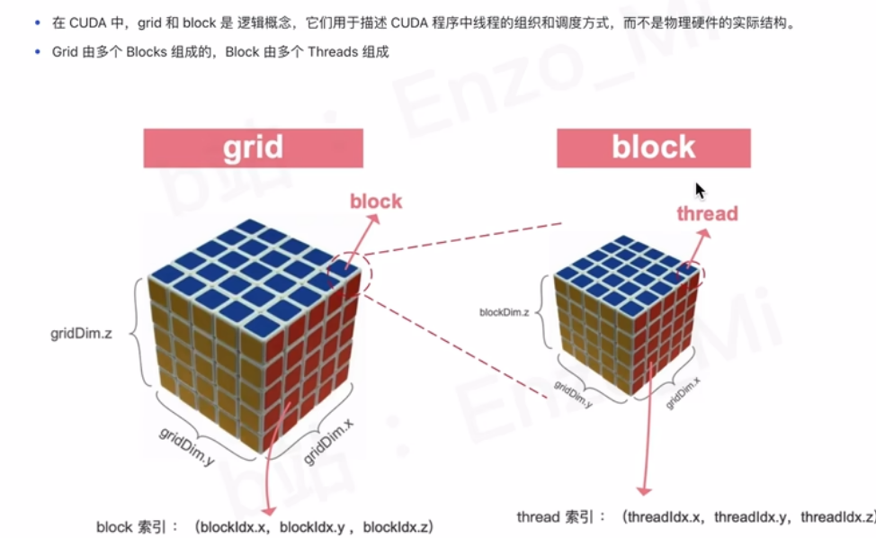

!!! note
    grid是那个大魔方，block是小的一个立方体，里面再包含线程thread

gridDim.x,gridDim.y,gridDim.z分别代表立方体的三边长度

blockDim.x,blockDim.y,blockDim.z分别代表立方体的三边长度

block索引：(blockldx.x,blockldx.y,blockldx.z)

thread索引:(threadldx.x,threadldx.y,threadldx.z)

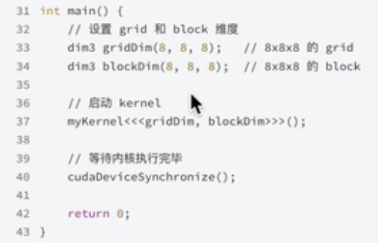

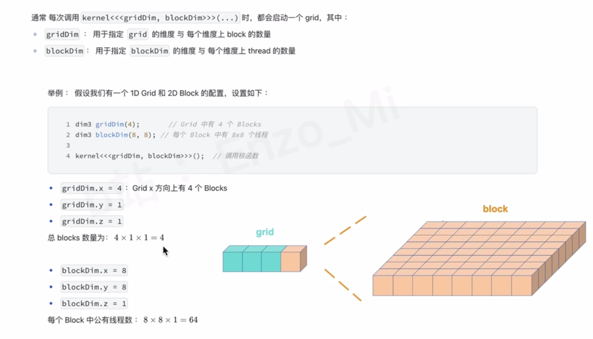

!!! note  "全局索引的计算"
    


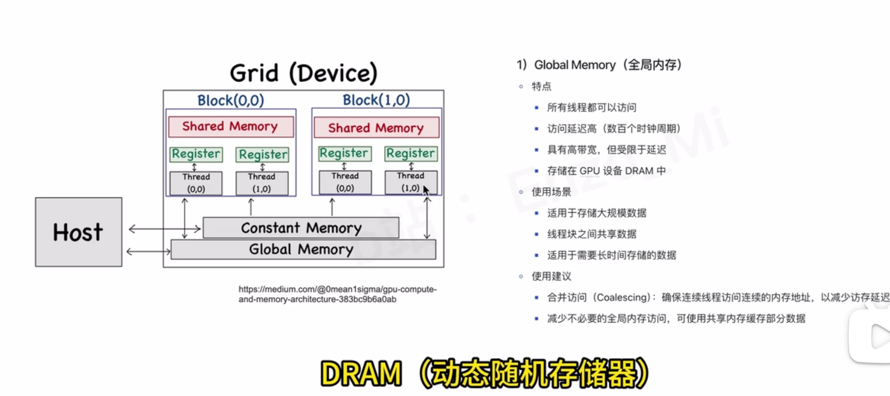

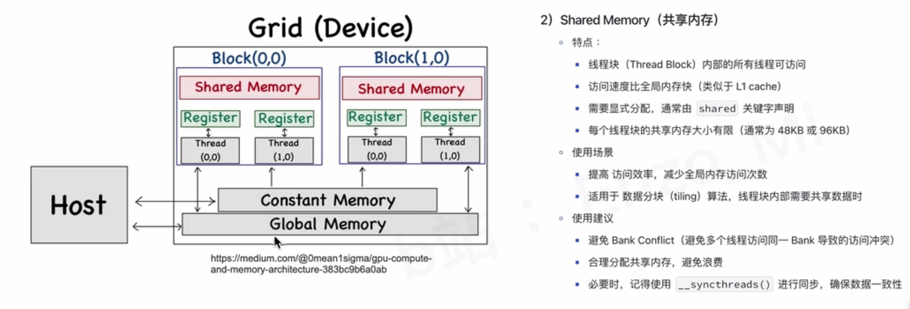

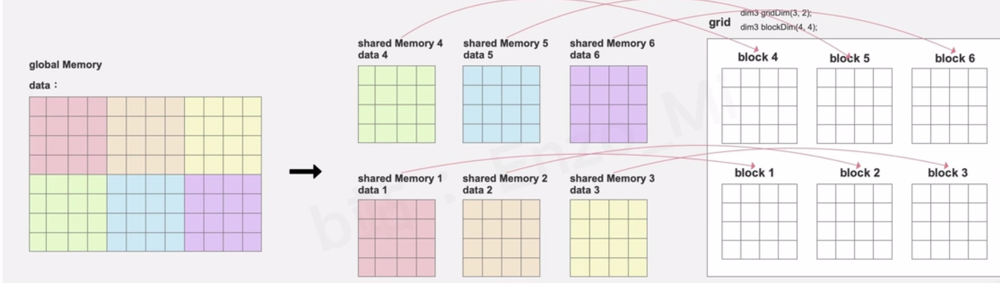

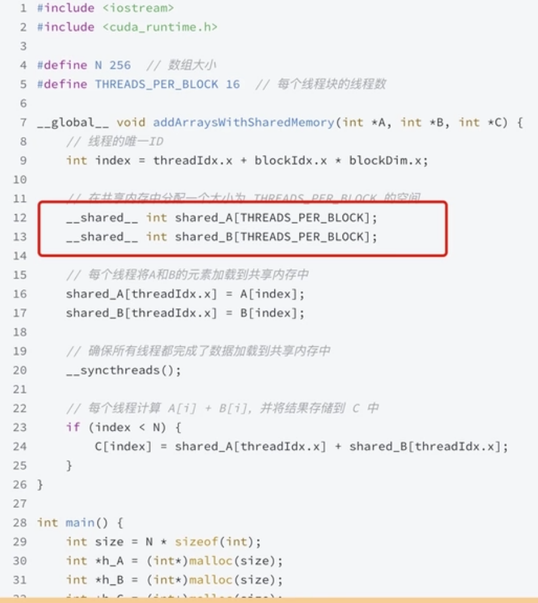

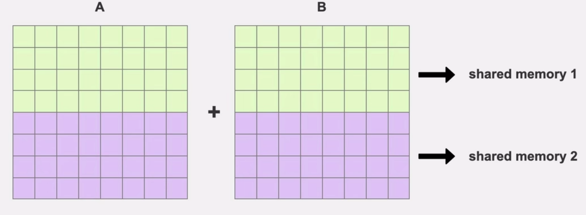

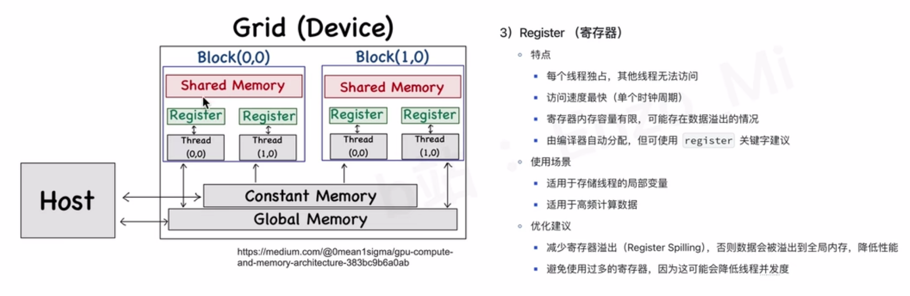

!!! tip  "存放在寄存器中的index"
    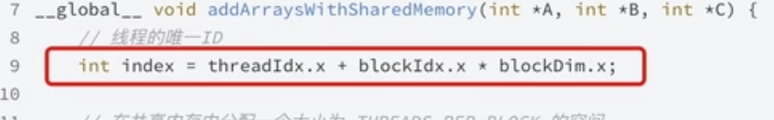


一个简单示例：
```cpp
#include <iostream>
#include <cuda_runtime.h>
#define N 256 // 数组大小
#define THREADS_PER_BLOCK 16 // 每个线程块的线程数
__global__ void addArrays(int *d_A, int *d_B, int *d_C) {
    int tid = threadIdx.x + blockIdx.x * blockDim.x;
    __shared__ int sharedMem[THREADS_PER_BLOCK];
    // Load data into shared memory
    sharedMem[tid % THREADS_PER_BLOCK] = d_A[tid] + d_B[tid];
    __syncthreads(); // Synchronize threads within the block
    // Store result back to global memory
    if (tid < N) {
        d_C[tid] = sharedMem[tid % THREADS_PER_BLOCK];
    }
}
int main() {
    int size = N * sizeof(int);
    int *h_A = (int*)malloc(size);
    int *h_B = (int*)malloc(size);
    int *h_C = (int*)malloc(size);
    // Initialize host arrays
    for (int i = 0; i < N; ++i) {
        h_A[i] = i;
        h_B[i] = i * 2;
    }
    int *d_A, *d_B, *d_C;
    cudaMalloc((void**)&d_A, size);
    cudaMalloc((void**)&d_B, size);
    cudaMalloc((void**)&d_C, size);
    cudaMemcpy(d_A, h_A, size, cudaMemcpyHostToDevice);
    cudaMemcpy(d_B, h_B, size, cudaMemcpyHostToDevice);
    // Calculate grid and block dimensions
    dim3 blockSize(THREADS_PER_BLOCK, 1, 1);
    dim3 gridSize((N + THREADS_PER_BLOCK - 1) / THREADS_PER_BLOCK, 1, 1);
    // Launch kernel function
    addArrays<<<gridSize, blockSize>>>(d_A, d_B, d_C);
    // Copy result back to host
    cudaMemcpy(h_C, d_C, size, cudaMemcpyDeviceToHost);
    // Print first 10 results
    for (int i = 0; i < 10; ++i) {
        std::cout << "C[" << i << "] = " << h_C[i] << std::endl;
    }
    // Free device memory
    cudaFree(d_A);
    cudaFree(d_B);
    cudaFree(d_C);
    // Free host memory
    free(h_A);
    free(h_B);
    free(h_C);
    return 0;
}
```
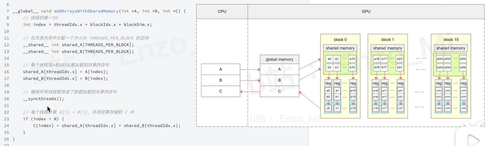

# cuda python

???+ csdn网站 
    cuda python,[click here](https://blog.csdn.net/qq_40938217/article/details/145222540?ops_request_misc=&request_id=&biz_id=102&utm_term=python%20cuda%E5%85%A5%E9%97%A8%E6%95%99%E7%A8%8B&utm_medium=distribute.pc_search_result.none-task-blog-2~all~sobaiduweb~default-1-145222540.142^v101^pc_search_result_base9&spm=1018.2226.3001.4187)

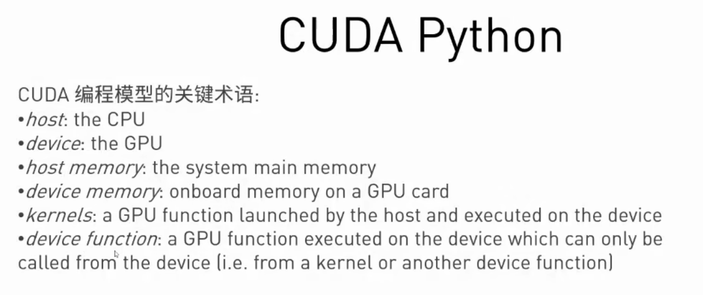


```python
import cv2
import numpy as np
from numba import cuda
import itme
import math

def progress_gpu(img,channels):

def progress_cpu(img,dst):
    rows,clos,channels=img.shape
    for i in range(rows):
        for j in range(cols):
            for c in range(3):
                color = img[i,j][c]*2.0+30
                if color>255:
                    dst[i,j][c]=255
                elif color<0:
                    dst[i,j][c]=0
                else:
                    dst[i,j][c]=color

if __name__ == "__main__":
    #create an image.
    img = cv2.imread('test-nvidia.jpg')
    rows,cols,channels=img.shape
    dst_cpu = img.copy()
    dst_gpu = img.copy()
    start_cpu = time.time()
    process_cpu(img,dst_cpu)
    end_cpu = time.time()
    time_cpu = (end_cpu-start_cpu)
    print("CPU process time: "+str(time_cpu))

```