# overview
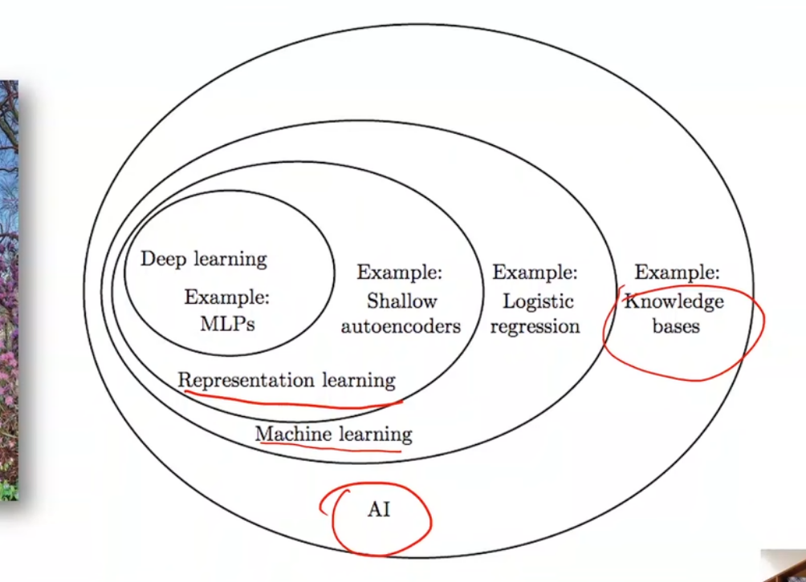


# 线性模型
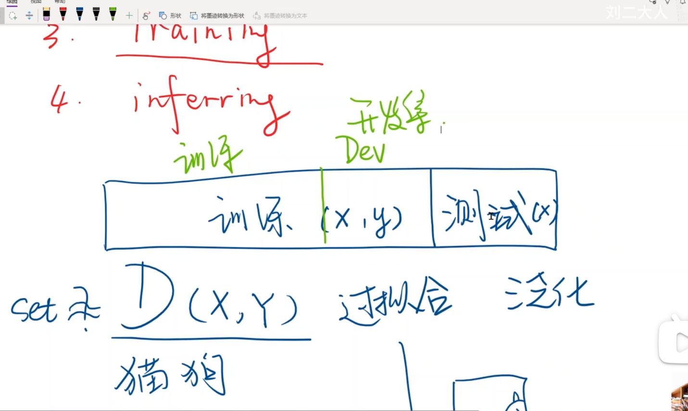
训练集一部分用来训练，一部分作为开发集


先用线性模型进行拟合，其最简单


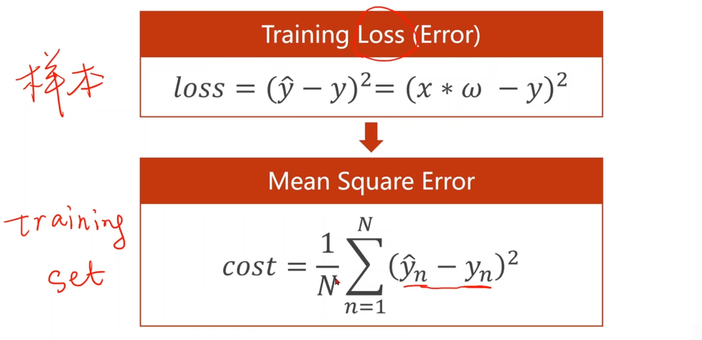
这种cost函数叫做MSE

# 梯度下降算法


# 反向传播

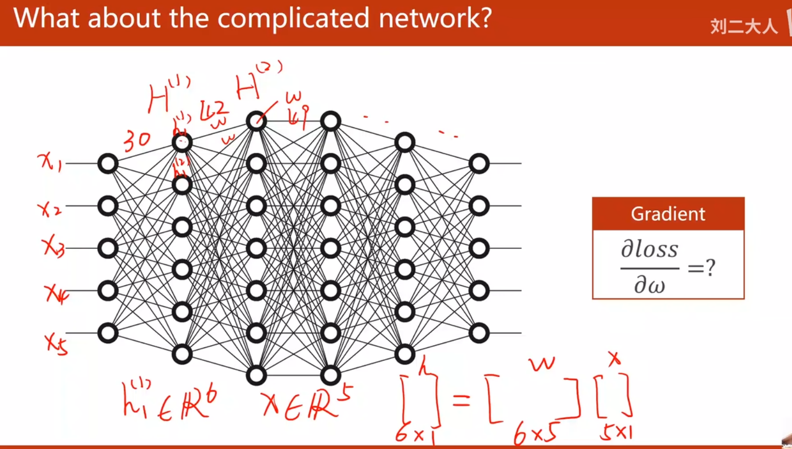

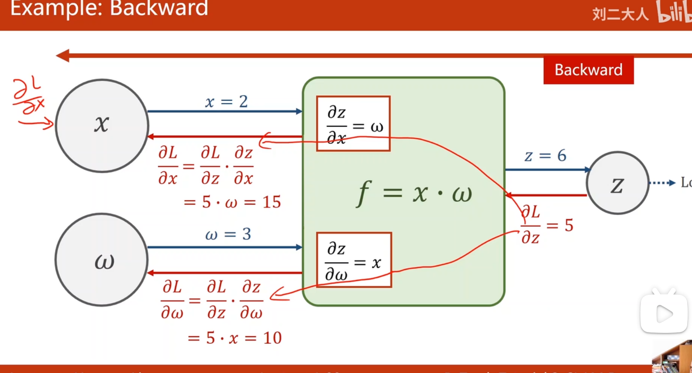

!!! warning
    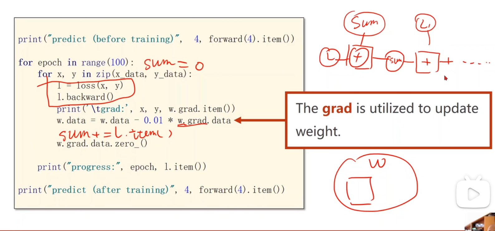
    不要直接＋l，因为l是个张量会不断构建计算图吃光内存，所以要用l.item()


```python
import torch
x_data = [1.0, 2.0, 3.0]
y_data = [2.0, 4.0, 6.0]

w = torch.Tensor([1.0])
w.requires_grad = True

def forward(x):
    return x*w

def loss(x,y):
    y_pred = forward(x)
    return (y_pred - y) ** 2


print("predict (before training)",4,forward(4).item())

for epoch in range(100):
    for x,y in zip(x_data,y_data):
        l = loss(x,y)#forward,compute the loss
        l.backward()#backward,compute grad for tensor whose requires_grad set to true
        print('\tgrad:',x,y,w.grad.item())
        w.data = w.data - 0.01 * w.grad.data#the grad is utilized to updata weight

        w.grad.data.zero_()#the grad computed by .backward() will be accunmulated.so after update,remember set the grad to zero!

    print("progress:",epoch,l.item())

print("predict(after training)",4, forward(4).item())

```

# 用pytorch实现线性回归
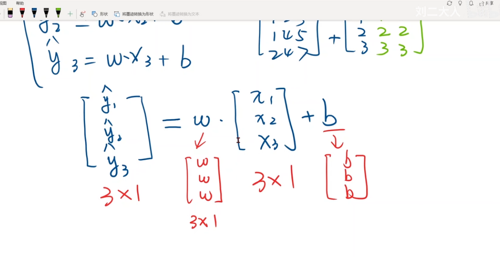
pytorch具有广播性

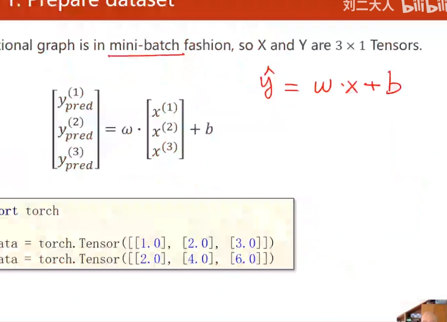
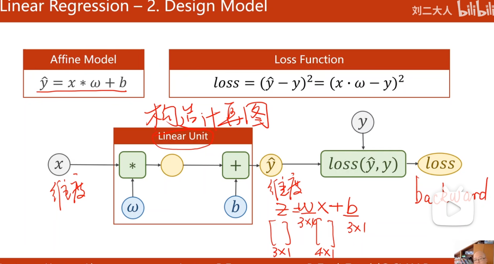

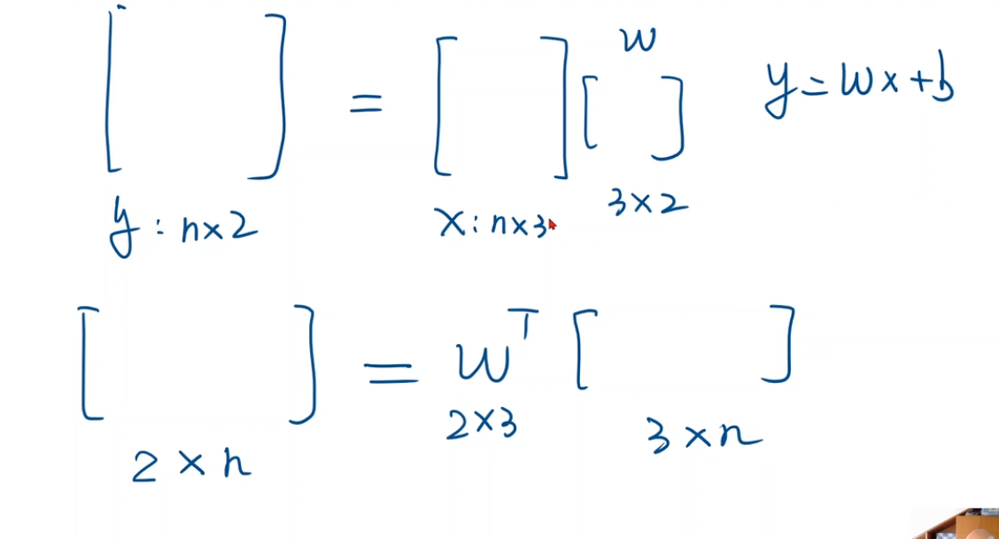
  
```python
class LinearModel(torch.nn.Module):
    def __init__(self):
        super(LinearModel,self).__init__()
        self.linear = torch.nn.Linear(1,1)

    def forward(self,x):
        y_pred = self.linear(x)
        return y_pred

model = LinearModel()
```

这段代码定义了一个使用 PyTorch 构建的线性模型，并且继承自 `torch.nn.Module`。以下是代码的详细解释：
1. 定义一个名为 `LinearModel` 的类，它继承自 `torch.nn.Module`：
python
class LinearModel(torch.nn.Module):
通过继承 `torch.nn.Module`，`LinearModel` 类可以访问 PyTorch 提供的模块化和功能，例如自动求导。
2. 初始化方法 `__init__`：
```python
def __init__(self):
    super(LinearModel,self).__init__()
    self.linear = torch.nn.Linear(1,1)
```
`__init__` 是类的构造函数，用于初始化对象。以下是 `__init__` 方法中的操作：
- 调用父类 `torch.nn.Module` 的 `__init__` 方法：
  python
  super(LinearModel,self).__init__()
  
  这一步是必须的，以确保父类的构造函数被正确调用，从而初始化父类中的属性和方法。
- 创建一个线性层并将其赋值给实例变量 `self.linear`：
  python
  `self.linear = torch.nn.Linear(1,1)`
  
  `torch.nn.Linear` 是 PyTorch 中定义的全连接层（也称为线性层）。这里的参数 `1, 1` 分别表示输入特征的数量和输出特征的数量。在这个例子中，模型接收一个特征作为输入，并输出一个特征作为预测结果。
3. 定义前向传播方法 `forward`：
```python
def forward(self,x):
    y_pred = self.linear(x)
    return y_pred
```
`forward` 方法定义了数据如何通过网络流动，即前向传播过程。以下是 `forward` 方法中的操作：
- 使用 `self.linear` 层处理输入 `x`，得到预测值 `y_pred`：
  python
  y_pred = self.linear(x)
  
  这一步调用了之前定义的全连接层，将输入 `x` 通过线性变换得到预测值 `y_pred`。
- 返回预测值 `y_pred`：
  python
  `return y_pred`

  
  这一步将预测值返回，以便可以在模型训练或推理时使用。
4. 创建 `LinearModel` 的实例：
python
`model = LinearModel()`
这一行代码创建了 `LinearModel` 类的一个实例，并将其赋值给变量 `model`。现在，`model` 对象具有 `forward` 方法，可以接收输入并返回预测结果。
总结来说，这段代码定义了一个简单的线性模型，它包含一个全连接层，并且可以接收单个特征作为输入，通过线性变换输出一个预测值。这个模型可以用于简单的回归任务。


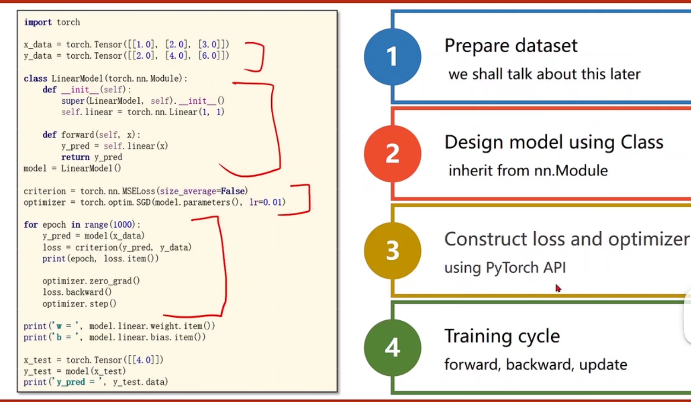

在PyTorch中，当你创建一个`torch.nn.Linear`层时，权重（weight）和偏置（bias）是自动为你初始化的。这些参数是层的内部属性，你可以在创建层之后直接访问它们。
下面是一个例子，展示了如何创建一个`Linear`层，并访问其权重和偏置：
```python
import torch.nn as nn
# 创建一个全连接层，输入特征数为1，输出特征数为1
linear_layer = nn.Linear(1, 1)
# 访问权重和偏置
weight = linear_layer.weight
bias = linear_layer.bias
# 打印权重和偏置
print("Weight:", weight)
print("Bias:", bias)
```
当你运行这段代码时，你会看到如下输出（注意，由于权重和偏置是随机初始化的，所以你看到的数值可能与以下不同）：
```
Weight: Parameter containing:
tensor([[0.0123]], requires_grad=True)
Bias: Parameter containing:
tensor([0.2345], requires_grad=True)
```
这里的`weight`是一个包含单个数值的1x1的张量（tensor），而`bias`是一个包含单个数值的张量。`requires_grad=True`表示这些参数在训练过程中会自动计算梯度，这对于后续的优化过程是必要的。
在实际使用中，你不需要直接操作这些权重和偏置，因为它们会在你通过网络传递数据时自动被更新。如果你想要自定义权重和偏置的初始化，你可以使用以下方式：
```python
# 创建一个全连接层，并自定义权重和偏置
linear_layer = nn.Linear(1, 1)
linear_layer.weight.data.fill_(value)  # 将权重设置为特定的值
linear_layer.bias.data.fill_(value)    # 将偏置设置为特定的值
```
在这里，`value`是你希望设置权重和偏置的数值。


```python
import torch
x_data = torch.Tensor([[1.0], [2.0], [3.0]])
y_data = torch.Tensor([[2.0], [4.0], [6.0]])
class LinearModel(torch.nn.Module):
    def __init__(self):
        super(LinearModel, self).__init__()
        self.linear = torch.nn.Linear(1, 1)
    def forward(self, x):
        y_pred = self.linear(x)
        return y_pred
model = LinearModel()
criterion = torch.nn.MSELoss(size_average=False)
optimizer = torch.optim.SGD(model.parameters(), lr=0.01)
for epoch in range(1000):
    y_pred = model(x_data)
    loss = criterion(y_pred, y_data)
    print(epoch, loss.item())
    optimizer.zero_grad()
    loss.backward()
    optimizer.step()
print('w = ', model.linear.weight.item())
print('b = ', model.linear.bias.item())
x_test = torch.Tensor([[4.0]])
y_test = model(x_test)
print('y_pred = ', y_test.data)
```


# 逻辑斯蒂回归模型
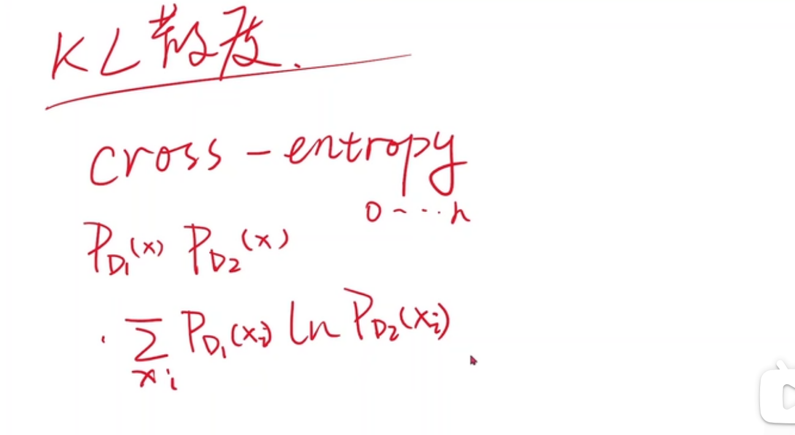
计算两个分布的差异，KL散度
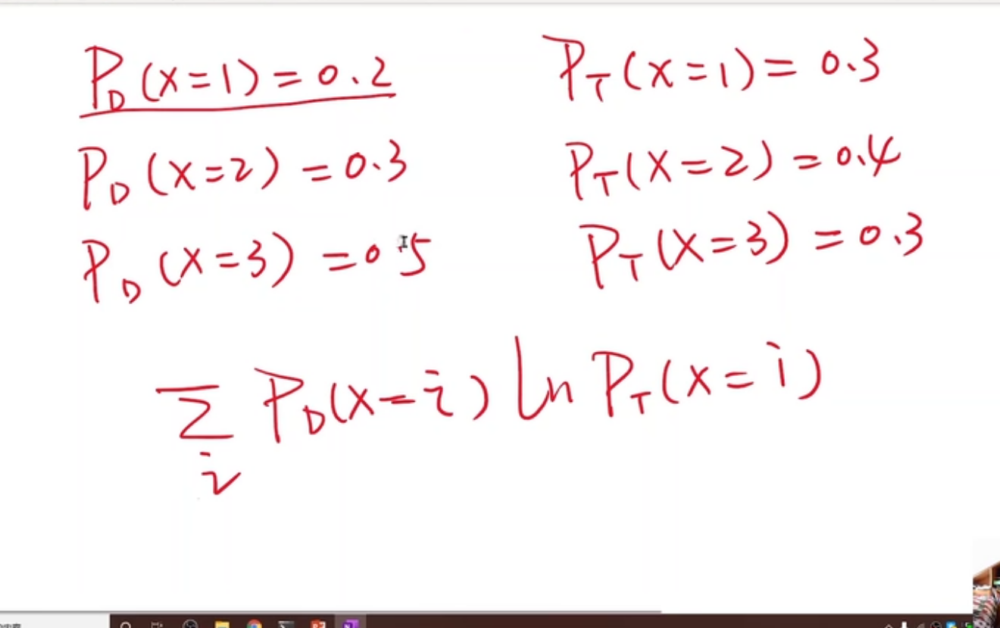


```python
    class LinearModel(torch.nn.Module):
        def __init__(self):
            super(LinearModel,self).__init__()
            self.linear = torch.nn.Linear(1,1)

        def forward(self,x):
            y_pred = self.linear(x)
            return y_pred

    model = LinearModel()
```
```python
    import torch.nn.functional as F

    class LogisticRegressionModel(torch.nn.Module):
        def __init__(self):
            super(LogisticRegressionModel,self).__init__()
            self.linear = torch.nn.Linear(1,1)

        def forward(self,x):
            y_pred = `F.sigmoid(self.linear(x))`
            return y_pred

    model = LinearModel()

 ```
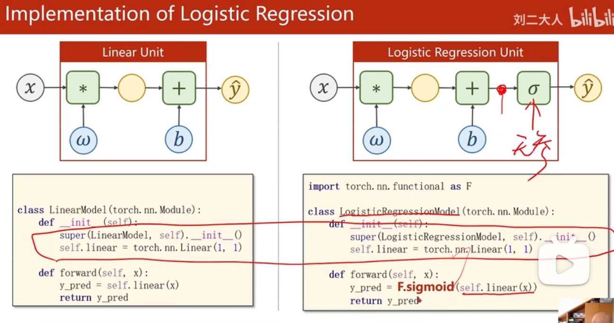
就多了一步


# 处理多维特征的输入
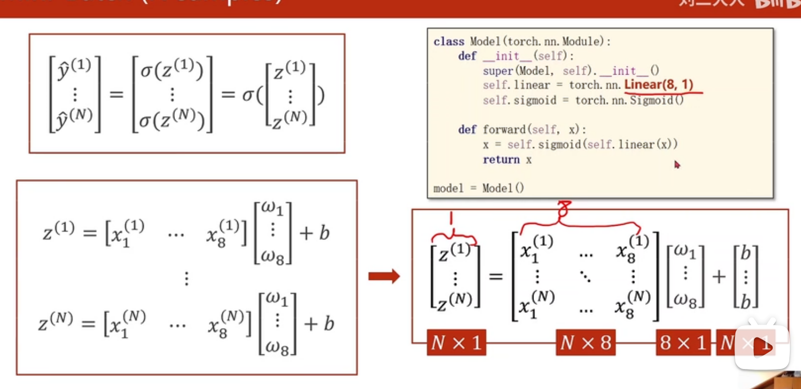
矩阵运算的意义是提供了并行，不用再写for循环了

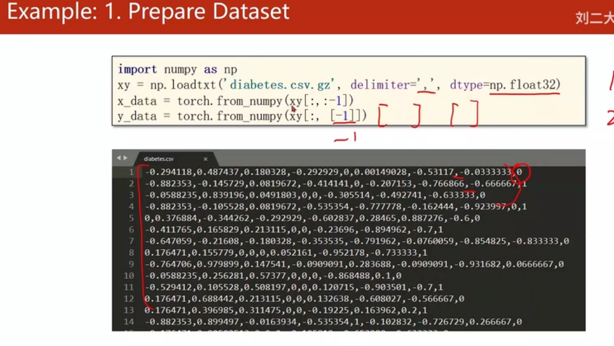

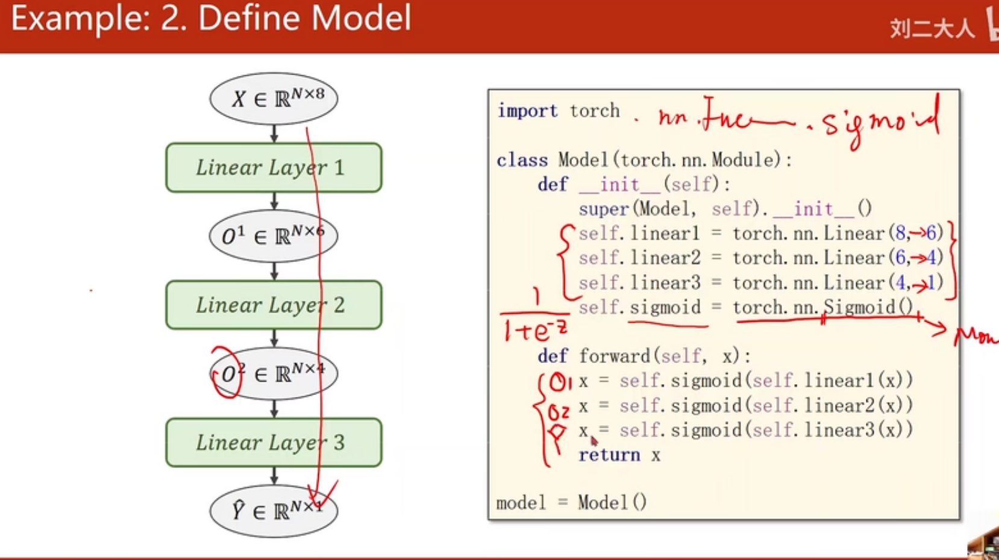
x写到底

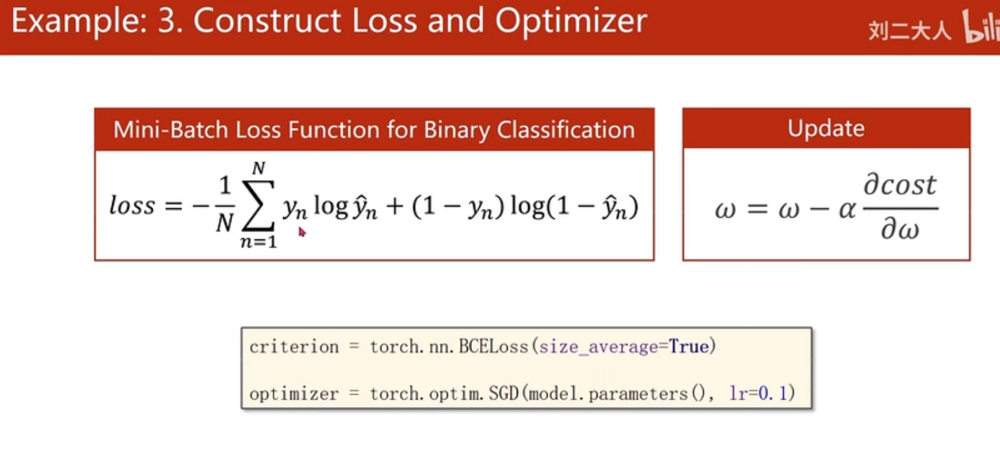

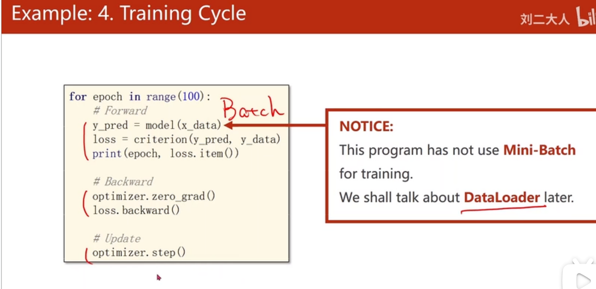
先预测，再计算得到loss，再用回溯backward函数找到梯度，然后减去学习率乘梯度进行更新

!!! tip
    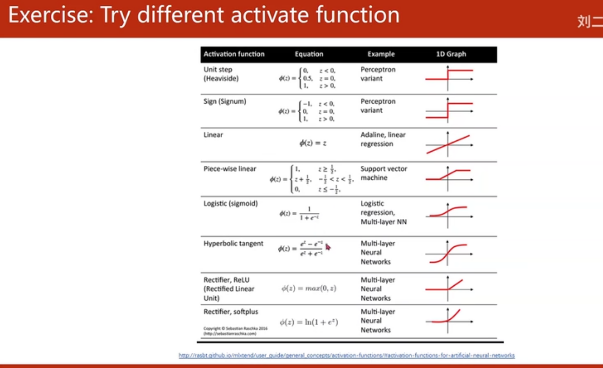
    很多激活函数，不只是sigma，建议都去试试
    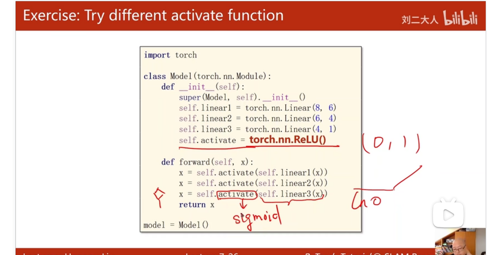


# 加载数据集


# 多分类
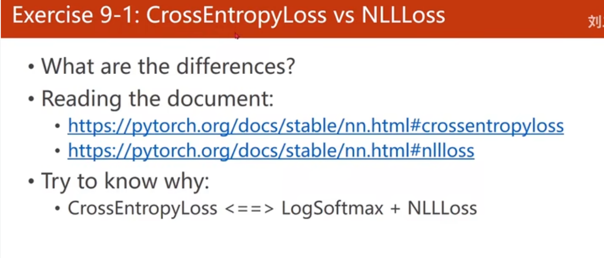
