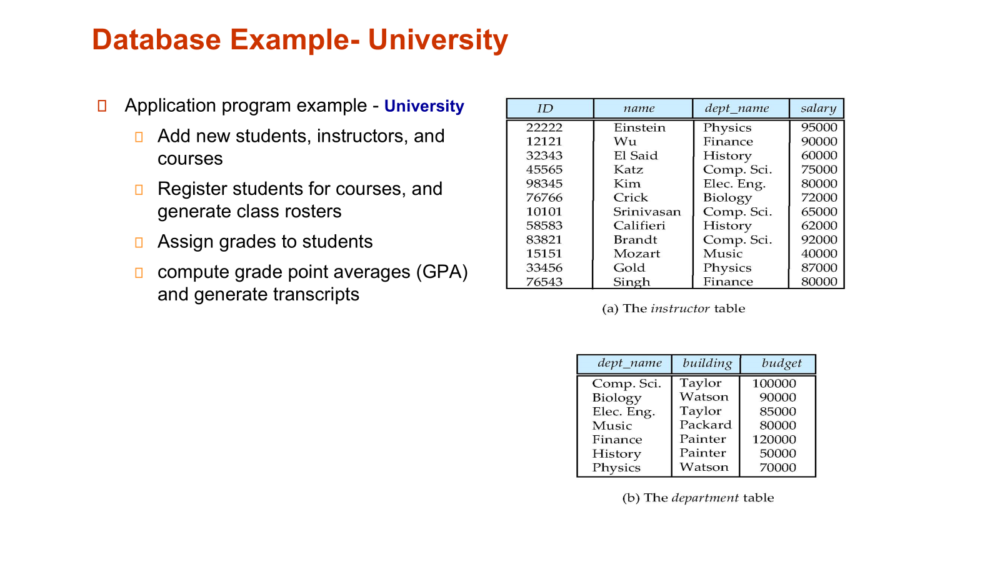

# chapter1:Introduction

关于这门课的实验相关网站，[click here](https://github.com/lhmd/ZJU-course/tree/master/%E6%95%B0%E6%8D%AE%E5%BA%93%E7%B3%BB%E7%BB%9F)

## 1.1 Database System

1. concurrent 并发

## 1.2 Database Applications

two examples:

## 1.3 Purpose of database system

## 1.4 characteristics of database

## 1.5 view of data

   

## 1.6 schema and instance

## 1.8 data models

## 1.9 rational model

