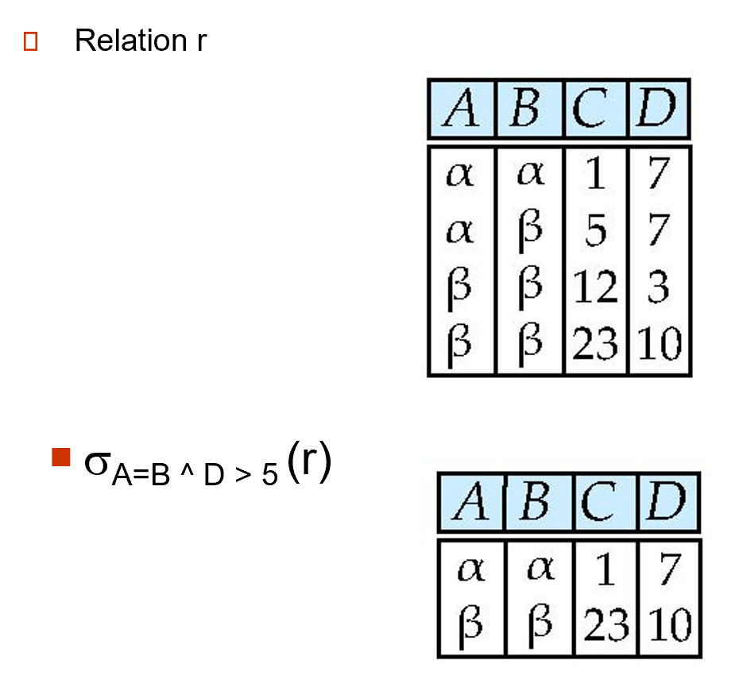
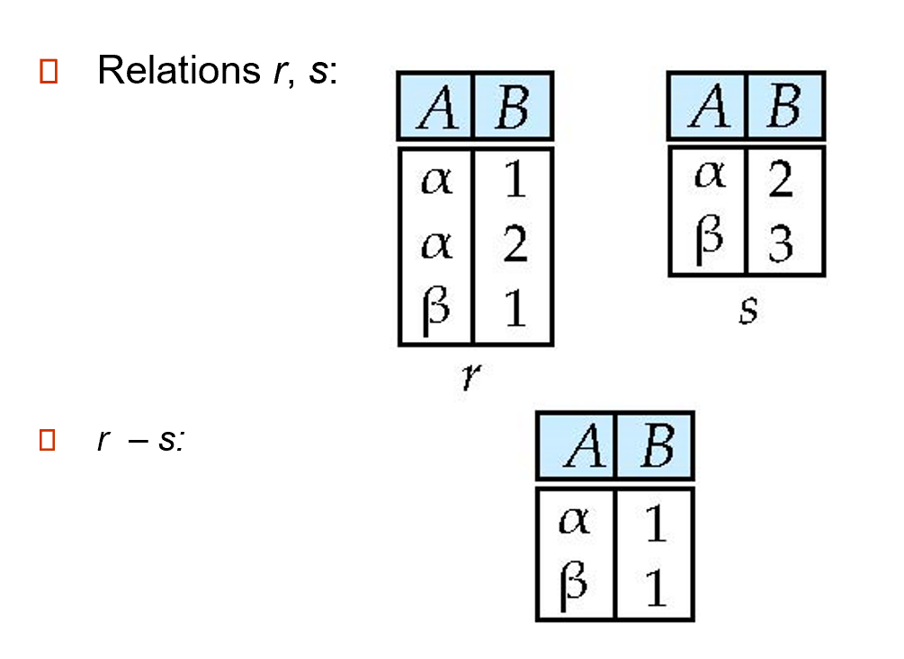
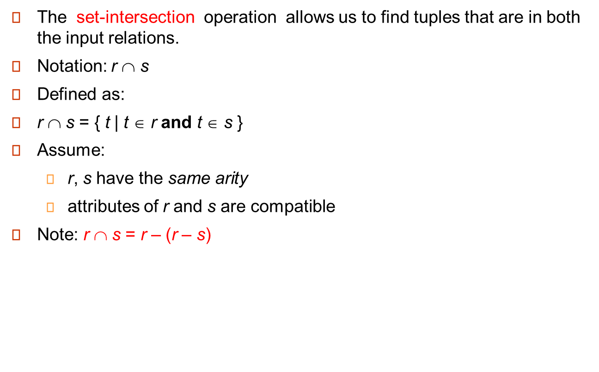
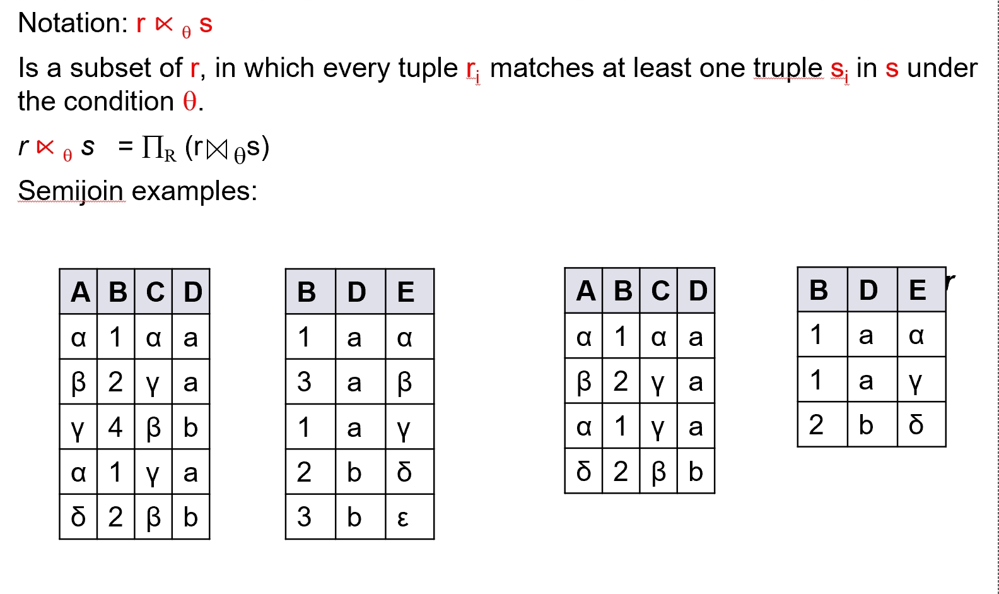
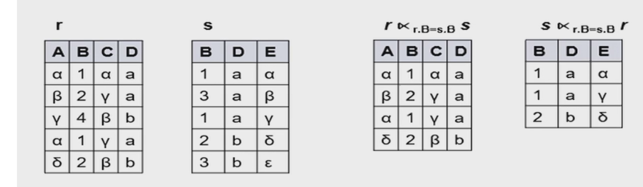
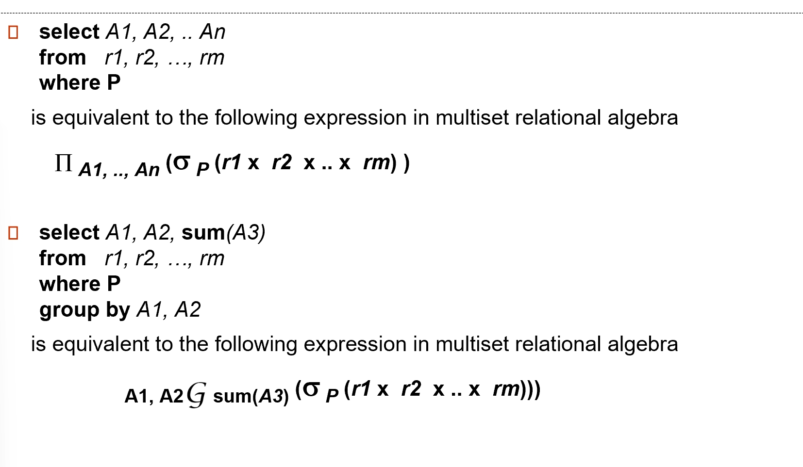

# chapter 2: The Rational Model

## 1.Structure of Relational Databases
### 1.1 Concepts
Formally, given sets `D1, D2, …. Dn` ,a `relation r` is a subset of  `D1 x  D2  x … x Dn`.Thus, a relation is a set of `n-tuples (a1, a2, …, an)` where each `ai 属于 Di`.
就是说，relation是好几个元组tuple

!!! example
    
A1, A2, …, An are attributes.A1, A2, …, An 是属性

R = (A1, A2, …, An ) is a relation schema.R = (A1, A2, …, An) 是一个关系模式

!!! Example
    `instructor  = (ID,  name, dept_name, salary)`
    A relation instance `r` defined over `schema R` is denoted  by `r (R)`.The current values a relation are specified by a table.An `element t` of relation `r` is called a  tuple and is represented by a row in a table

### 1.2  attributes
- The `set of allowed values` for each attribute is called the `domain（域）` of the attribute
- Attribute values are (normally) required to be `atomic（原子的`）; that is, indivisible  (attribute values不可再分，如诸葛亮，张飞，不要再拆成姓和名)
- The special value null （空值） is a member of every domain(任何一个值域里面都有一个null值)
- The null value causes complications in the definition of many operations

### 1.3 relations are unordered
Order of tuples is irrelevant (tuples may be stored in an arbitrary order)

## 2 Database schema
- **Database schema** -- is the logical structure of the database.
- **Database instance** -- is a snapshot of the data in the database at a given instant in time.数据库实例：某个时间点数据库的快照

??? example
    

## 3 Keys

- K is a **superkey (超键)** of R if values for K are sufficient to identify (唯一确定) unique tuple of each possible relation r(R).
 e.g. {ID} or {ID, name}
- **Superkey K** is a **candidate key (候选键)** if K is minimal.
即 K 中没有冗余属性.候选键是超键中最小的集合，它的任何一个真子集不可确定唯一一个元组
- One of the candidate keys is selected to be the primary key (主键).
- **Foreign key (外键)** Relation r1 may include among its attributes the primary key of another relation r2. This attribute is called a foreign key from r1, referencing r2.
类似于指针，外键限制就是关系 r1 引用的主键必须在关系 r2 中出现。
- **Referential integrity(参照完整性)** constraint  requires that  the values appearing in specified attribute(s) A of any tuples in the referencing relation r1 also appear in specified attribute(s) B of at least one tuple in the referenced relation r2.**类似于外键限制，但不局限于主键**.

???  "外键"
    

???  "参照完整性"
    

## 4 Database and Schema diagram

!!! example
    

!!! example  "schema diagram"
    
    

## 5 Rational Query languages

- Procedural vs.non-procedural, or declarative
- “Pure” languages:
    - **Relational algebra(关系代数)**
    - Tuple relational calculus（元组关系演算）
    - Domain relational calculus（域关系演算）
- The above 3 pure languages are equivalent in computing power
- We will concentrate on relational algebra
    - Not Turing-machine equivalent
    - Consists of 6 basic operations

### 5.1 Select

??? select example
    

### 5.2 project投影

??? project example
    

### 5.3 union

作用对象是关系relation,可用来连接两个select

??? union example
    
    

### 5.4 set difference

作用在两个relation，可用来对两个select相减

??? set difference example
    

### 5.5 Cartesian-Product Operation

??? example
    

### 5.6 compositions of operations

### 5.7 rename operations

密度符号ρ！

### 5.8 Some Query Examples

???+ example1
    

???+ example2
    

???+ example3
    
    
    只要存在比你的工资高的人，你的工资就被挑出来，然后所有工资减去所有你们的工资就是最高工资，也就是不会被挑出来的工资

### 5.9 Formal Definition

这些都是关系代数表达式

### 5.10 Additional operands
!!! note
    

#### 5.10.1 Set intersection

??? example
    

#### 5.10.2 Natural-Join operation

??? example
    

- **theta join**

!!! tip theta join
    
    一些性质，交换律、结合律，和theta join的符号表示

#### 5.10.3 Outer Join

第一个公式配着下面的example比较好理解，r减去((R)和(rs的natural set)的交),也就是左边的列都存在，右边的列内容全部用null补上。第二个工式同理。第三个同同理。

???+ examples
    

#### 5.10.4 semijoin

简单来说，上式就是保留r中能与s相连的元组

???+ example
    
    r.B=s.B,但最终要保证B和D都相等？为什么呢？

- Semijoin（半连接） Operation and Nested Query

    
!!! tip
    
    

#### 5.10.5 Division Operation

??? example
    
    

### 5.11  Aggregate Functions and Operations

!!! tip
    
    

G1,G2等等是用来分组用的

??? example
    

## 6 Multiset Relational Algebra

这张图片的核心内容是关于纯关系代数和多集合（多重集）关系代数的区别和定义。具体内容包括：
1. **纯关系代数**：移除所有重复项，例如在投影之后。
2. **多集合（多重集）关系代数**：保留重复项以匹配SQL语义。
   - SQL最初保留重复项是为了效率考虑，但现在这是一个特性。
3. **多集合关系代数的定义如下**：
   - **选择（selection）**：如果元组满足选择条件，则保留与输入中相同数量的重复元组。
   - **投影（projection）**：每个输入元组产生一个输出元组，即使它是重复的。
   - **笛卡尔积（cross product）**：如果在关系r中有m个t1的副本，在关系s中有n个t2的副本，则在r × s中有m × n个t1.t2的副本。
4. **集合运算符**：
   - **并集（union）**：m + n个副本。
   - **交集（intersection）**：min(m, n)个副本。
   - **差集（difference）**：min(0, m - n)个副本。
这些概念帮助理解如何在不同的关系代数系统中处理和处理数据，特别是在涉及到重复数据的情况下。

!!! note  "讲人话"
    关系代数中，我们要求关系要是一个严格的集合。但实际数据库中并不是，而是一个多重集，允许有重复元素存在。因为一些操作的中间结果会带来重复元素，要保持集合特性开销很大，因此实际操作中不会去重。

## 7 SQL and Relational Algebra

!!! note "说人话"
    

