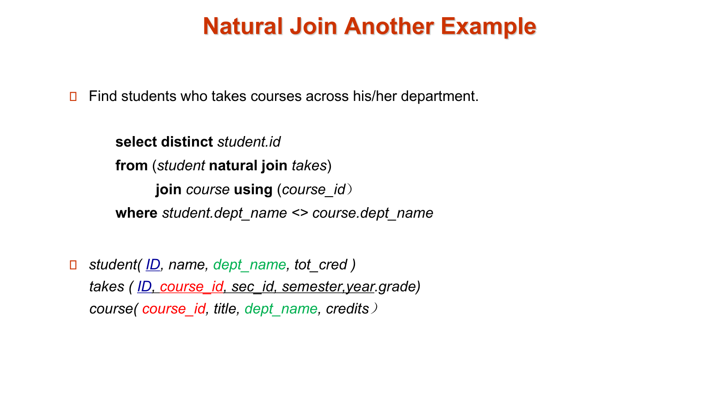
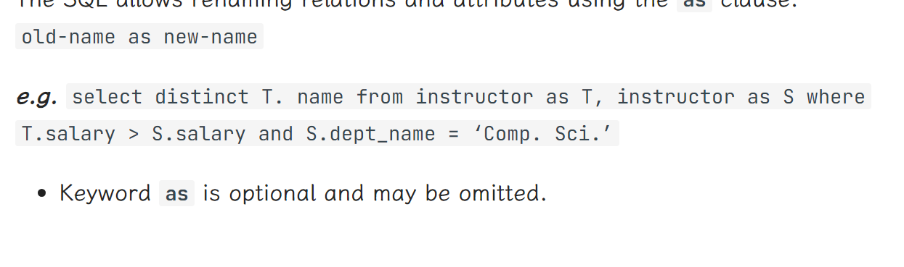
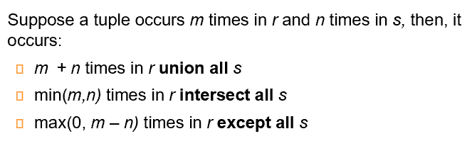
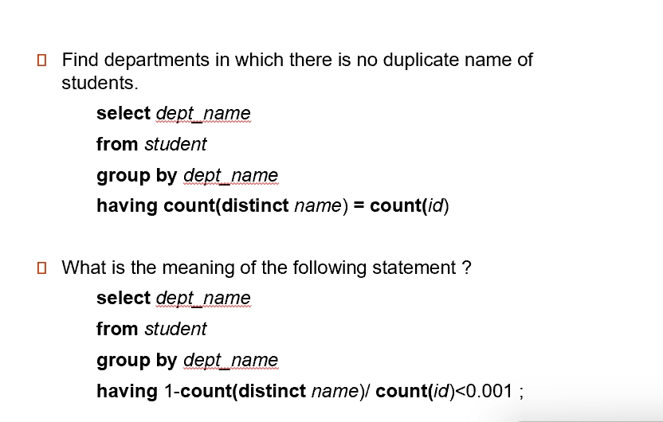
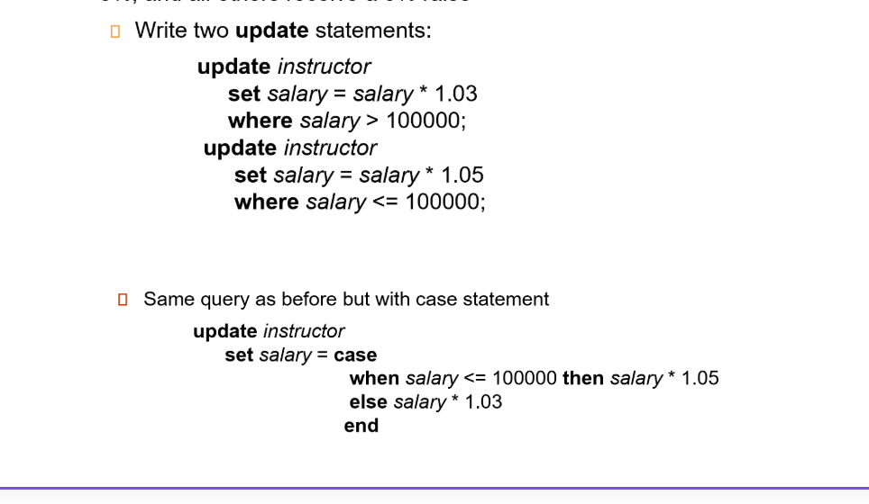

# chapter3: introduction to SQL

## 1 overview of the SQL Query Language


## 2 Data Definition
### 2.1 Domain Types in SQL
- `char(n).` Fixed length character string, with user-specified length n.
定长字符串. C 语言里字符串结尾有 `\0`, 但数据库里没有，长度由定义而得。
- `varchar(n).` Variable length character strings, with user-specified maximum length n.
不定长字符串。不同的数据类型比较可能有问题（比如定长和不定长的字符串）
- `int.` Integer (a finite subset of the integers that is machine-dependent).
- `smallint.` Small integer (a machine-dependent subset of the integer domain type).
- `numeric(p,d).` Fixed point number, with user-specified precision of p digits, with d digits to the right of decimal point.
p 表示有效数字位数, d 表示小数点后多少位。 e.g. - `number(3,1)` allows 44.5 to be store exactly, but neither 444.5 or 0.32
- `real, double precision.` Floating point and double-precision floating point numbers, with machine-dependent precision.
- `float(n).` Floating point number, with user-specified precision of at least n digits.

### 2.2 built-in Data Types in SQL
- `date: `Dates, containing a (4 digit) year, month and date
e.g. `date ‘2005-7-27’`
- `time:` Time of day, in hours, minutes and seconds. **e.g.** time ‘09:00:30’ time ‘09:00:30.75’
- `timestamp:` date plus time of day **e.g.** `timestamp ‘2005-7-27 09:00:30.75’`
- `interval:` period of time **e.g.**` interval ‘1’ day`
    - Subtracting a date/time/timestamp value from another gives an interval value.
    - Interval values can be added to date/time/timestamp values
    - built-in date, time functions: current_date(), current_time(), year(x), month(x), day(x), hour(x), minute(x), second(x)

### 2.3 Create Table Construct


??? "Integrity Constraints in Create table"
    
    primary key代表不能为空，同时表内不能有相同的keys，否则这样的数据是插不进去的
    foreign key代表引用对应表的主键

??? "another example"
    
    - 当前情况下，学生A（ID=12345）可以在2023年秋季学期（semester='Fall', year=2023）注册课程CSC101（course_id='CSC101'）的两个不同部分（sec_id='001' 和 sec_id='002'）。这是因为主键组合（12345, CSC101, 001, Fall, 2023）和（12345, CSC101, 002, Fall, 2023）被视为不同的记录，数据库允许这种操作。
    - 如果从主键中移除 sec_id，主键将变为（12345, CSC101, Fall, 2023）。这样，数据库将不允许学生A在同一个学期内注册课程CSC101的多个部分，因为插入具有相同主键的记录会被拒绝。这种调整确保了学生不会在同一个学期内重复注册同一门课程的不同部分。
    
!!! tip "default 0"
    在 SQL 中，default 0 是用于定义列的默认值的语法。具体来说，default 0 表示当向表中插入新记录时，如果没有为该列（这里是 tot_cred）提供明确的值，数据库将自动将该列的值设置为 0。

??? "and more"
    
    如果引用的表中有条目被删除，可能会破坏完整性约束条件。有下面的方法：

    - restrict: 如果有条目是被引用的，那么不允许删除。
    - cascade: 引用的条目被删了之后，引用者也一并删除
    - set null: 引用者的指针设为 null.
    - set default
    如果引用的表中有更新，也有类似上面的四种方法。
    在 create table 中定义

    - on delete cascade |set null |restrict |set default
    - on update cascade |set null |restrict |set default

### 2.4 drop and alter table constructs


## 3 Basic Query Structure

### 3.1 the select clause


### 3.2 the where clause
The `where` clause specifies conditions that the result must satisfy.
Corresponds to the selection predicate of the relational algebra.
- Comparison results can be combined using the logical connectives and, or, and not.Comparisons can be applied to results of arithmetic expressions.**e.g.**`select name from instructor where dept_name = ‘Comp. Sci.'  and salary > 80000`

- SQL includes a **between** comparison operator **e.g.** `select name from instructor where salary between 90000 and 100000`
- Tuple comparison
元组相等等价于各个元素都相等。 **e.g.** `select name, course_id from instructor, teaches where (instructor.ID, dept_name) = (teaches.ID, ’Biology’);`

### 3.3 the from clause
The `from` clause lists the relations involved in the query.
Corresponds to the **Cartesian product** operation of the relational algebra.

### 3.4 natural join

!!! note  "join"
    


??? "example"
    

??? "example of unrelated but same name causing fault"
    
    直接三个自然连接的话instructor.dept_nme和course.dept_name会强制相等，但我们并不需要。
    所以为了改进我们有三种等价的改进方式。第一种是先把instructor和teaches自然连接，结果和course取笛卡尔积。第二种思路和第一种完全一样，用了join course using(course_id)，即只要求course_id相同的连接，可谓耳目一新。第三种就无脑写条件了。

??? "再来一个例子"
    

### 3.5 the rename operation

instructor as T <==> instructor T

### 3.6 string operations


- 匹配字符串 `'100 %'` 但是 `%` 符号被我们作为了通配符，这里我们需要用到转义符 `\`. `\%` 即将 `% `作为正常字符匹配。
- `\` 也可以是一个基本符号，我们需要在后面写出 `escape` 表示其在这里作为转义符。类似地我们还可以将转义符定义为 `#`.
  


### 3.7 ordering the display of tuples

### 3.8 the limit clause

limit 0,3 从第0行开始，输出三行，效果和直接输出前三行是一样滴

### 3.9 the set clause
- `union, intersect, except` 是严格的集合操作，会对结果去重.
- `union all, intersect all and except all`. 保持多重集。


!!! tip
    
    not difficult to understand

### 3.10 the null value


a nice guy,"unknown"

### 3.11 aggregate functions
!!! example
    

#### 3.11.1 having clauses

??? "instructor table"
    


- 输出按组(dept_name)分好的,而且只有工资大于四万二的导师信息！

???  "SQL 查询解释"
    ### 查询语句：
    ```sql
    SELECT dept_name, COUNT(*) AS cnt
    FROM instructor
    WHERE salary >= 100000
    GROUP BY dept_name
    HAVING COUNT(*) > 10
    ORDER BY cnt;
    ```

    ### 详细解释：

    1. **`FROM instructor`**：
       - 查询从 `instructor` 表中获取数据。

    2. **`WHERE salary >= 100000`**：
       - 过滤条件，只选择薪水大于或等于 100,000 的教师。

    3. **`GROUP BY dept_name`**：
       - 将结果按部门名称（`dept_name`）进行分组。这意味着每个部门会有一个对应的行。

    4. **`COUNT(*) AS cnt`**：
       - 对每个部门（`dept_name`）计算满足条件的教师人数，并将这个人数命名为 `cnt`。

    5. **`HAVING COUNT(*) > 10`**：
       - 过滤分组后的结果，只保留那些教师人数（`cnt`）大于 10 的部门。
       - `HAVING` 子句用于过滤分组后的结果，而 `WHERE` 子句用于过滤分组前的行。

    6. **`ORDER BY cnt`**：
       - 按教师人数（`cnt`）对结果进行排序。默认是升序排序（从小到大）。

    ### 示例：

    假设 `instructor` 表中有以下数据：

    | ID  | name     | dept_name | salary  |
    |-----|----------|-----------|---------|
    | 1   | Alice    | CS        | 120000  |
    | 2   | Bob      | CS        | 110000  |
    | 3   | Charlie  | CS        | 105000  |
    | 4   | David    | Math      | 95000   |
    | 5   | Eve      | Math      | 102000  |
    | 6   | Frank    | Math      | 98000   |
    | 7   | Grace    | Physics   | 130000  |
    | 8   | Heidi    | Physics   | 125000  |
    | 9   | Ivan     | Physics   | 115000  |
    | 10  | Judy     | Physics   | 110000  |
    | 11  | Kevin    | Physics   | 105000  |
    | 12  | Linda    | Physics   | 100000  |
    | 13  | Michael  | Physics   | 95000   |
    | 14  | Nancy    | Physics   | 90000   |
    | 15  | Oscar    | Physics   | 85000   |

    ### 查询步骤：

    1. **`WHERE salary >= 100000`**：
       - 过滤出薪水大于或等于 100,000 的教师：
         | ID  | name     | dept_name | salary  |
         |-----|----------|-----------|---------|
         | 1   | Alice    | CS        | 120000  |
         | 2   | Bob      | CS        | 110000  |
         | 3   | Charlie  | CS        | 105000  |
         | 5   | Eve      | Math      | 102000  |
         | 7   | Grace    | Physics   | 130000  |
         | 8   | Heidi    | Physics   | 125000  |
         | 9   | Ivan     | Physics   | 115000  |
         | 10  | Judy     | Physics   | 110000  |
         | 11  | Kevin    | Physics   | 105000  |
         | 12  | Linda    | Physics   | 100000  |

    2. **`GROUP BY dept_name`** 和 **`COUNT(*) AS cnt`**：
       - 按部门分组并计算每个部门的教师人数：
         | dept_name | cnt |
         |-----------|-----|
         | CS        | 3   |
         | Math      | 1   |
         | Physics   | 6   |

    3. **`HAVING COUNT(*) > 10`**：
       - 过滤掉教师人数不超过 10 的部门。在这个例子中，所有部门的教师人数都小于或等于 10，所以结果集为空。

    ### 总结：
    - 查询的目的是找出那些薪水大于或等于 100,000 的教师人数超过 10 的部门，并按教师人数排序。
    - 如果某个部门的教师人数超过 10，结果将显示该部门的名称和教师人数。
    - 在这个示例中，没有部门的教师人数超过 10，所以结果集为空。 

#### 3.11.2 null values and aggregates


??? "arithmetic with aggregate functions"
    

### 3.12 nested subqueries
A subquery is a select-from-where expression that is nested within another query.

#### 3.12.1 set membership
`in,not in`

??? example
    
    

#### 3.12.2 set comparison
- `some` 某些成员
- `all` 所有成员

??? example
    
    

#### 3.12.3 scalar subquery
**scalar(标量) subquery** is one whle is used where a single value is expected.

??? example
    

#### 3.12.4 test for empty relations


!!! example
    
    
    

#### 3.12.5 test for absence of duplicate tuples
- The unique construct tests whether a subquery has any duplicate tuples in its result.验证是否是一个集合，而非多重集。

- Evaluates to “true” on an empty set.可以将 unique 理解为 at most once.

!!! example
    
    

!!! tip
    
    


#### 2.13 with clause

## 4 Modification of the Database
### 4.1 deletion

??? example
    


### 4.2 insertion

??? example
    

除了基本写法，我们还可以在 insert 后跟查询语句，把查询结果插入到表里去。

??? example
    
    把老师加入学生里面


### 4.3 updates
update ... set ...

The order is important. So it can be done better using the case statement.

??? example
    