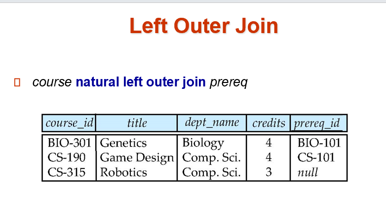
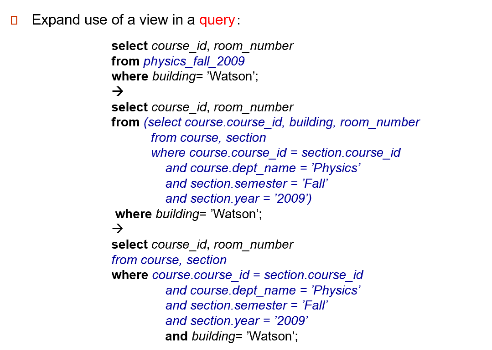

# Intermediate SQL

## 1 Joined Relation

??? examples
    
    
    
    
    
    natural join是公用一列相同的值，inner join on 是把相同的值写成两列，left/right outer join和left/right natural outer join不一样，但fully outer join和fully natural join是一样的
    

## 2 SQL Data Types and Schemas

### 2.1 User-Defined Types

### 2.2 Domains

domain可以加not null或check等限制

### 2.3 Large-Object Types
Large objects (photos, videos, CAD files, etc.) are stored as a large object:

- **blob**: binary large object -- object is a large collection of uninterpreted binary data (whose interpretation is left to an application outside of the database system)
存储大对象数据类型，实际上只是存放指针。

??? "BLOB in MySQL"
    

- **clob**: character large object -- object is a large collection of character data
文本大对象

## 3 Integrty Constraints
- **not null**
- **primary key**
- **unique**:

unique(A1, A2, ..., Am) The unique specification states that the attributes A1, A2, ..., Am form a super key （不一定是 candidate key)

比如学生个人信息，我们知道 ID 是主键，但实际上邮箱、电话号码等也不能相同的，所以我们要通过语句告诉数据库，数据库会为我们维护这些约束条件。

Candidate keys are permitted to be null (in contrast to primary keys).候选键是可以为空的，但是不能有重复
- **check (P)**, where P is a predicate

??? "example"
    

??? cascade in reference
    

!!! warning  "Integrity Constraint Violation During Transaction"
    
    如何在不违反约束的情况下插入元组？ 在插入人之前插入人的父和母 或者，将父和母初始设置为空，在插入所有人之后更新（如果父和母属性声明为非空则不可能）或者将约束检查推迟到事务结束。

- **assertion**:create assertion < assertion-name > check < predicate >;

???  "example"
    

## 4 views

### 4.1 view definition

view 可以隐掉一些细节，或者加上一些统计数据。可以把 view 当作表进行查询。

- 隐藏不必要的细节，简化用户视野
- 方便查询书写
- 有利于权限控制（如用户可以看到工资总和，但不能看到每个人的工资）
- 有独立性，使得数据库应用具有较强的适应性。

??? "example views"
    

可以基于视图再定义视图。

??? "view defined using other views"
    

??? "view expansion"
    
    

### 4.2 update of a view
对一个 view 进行修改，相当于通过这个窗口对原表继续修改。

插入后，原表也会有这条数据，对于其缺少的 salary 属性，我们设定为 NULL. 如果这个属性的约束是 not NULL 的，那么我们无法执行这次插入。

!!! tip
    

### 4.3 view and logical data independence

### 4.4 materialized view

## 5 indexes

indexes are data structures used to speed up access to records with specified values for index attributes.

Index 相当于在数据上建立了 B+ 树索引。（物理层面）

!!! note  "example"
    

## 6 Transaction

???+ "example"
    

### 6.1 ACID properties
A transaction is a unit of program execution that accesses and possibly updates various data items.To preserve the integrity of data the database system must ensure: (原子性、一致性、独立性、持续性)

- **Atomicity**. Either all operations of the transaction are properly reflected in the database or none are.
- **Consistency**. Execution of a transaction in isolation preserves the consistency of the database.
数据库执行事务前后都是一致的。
- **Isolation**. Although multiple transactions may execute concurrently, each transaction must be unaware of other concurrently executing transactions. Intermediate transaction results must be hidden from other concurrently executed transactions.
很多事情共同执行，他们不能互相影响。
    - That is, for every pair of transactions Ti and Tj, it appears to Ti that either Tj finished execution before Ti started, or Tj started execution after Ti finished.
- **Durability**. After a transaction completes successfully, the changes it has made to the database persist, even if there are system failures.
数据库的事务一旦提交，这个修改就要持续地保存到数据库中去，不能丢失。如磁盘出问题了，断电了等会引发这个问题。
通常使用日志。

## 7 authorization

grant < privilege list > on < relation name or view name > to < user list >
把某个表或者视图上的权限授权给用户

< user list > is:

- a user-id
- public, which allows all valid users the privilege granted
- A role (more on this later)

!!! note "privilege"
    
    update 可以细化到具体可以对哪列进行修改。

!!! note "revoke"
    

!!! note "role"
    

!!! tip  "碎碎念"
    
    
    