# Advanced SQL

## 1 Accessing SQL from a Programming Language
- Not all queries can be expressed in SQL, since SQL does not provide the full expressive power of a general-purpose language.
- 不是所有的查询都能用 SQL 语言表达。
- Non-declarative actions -- such as printing a report, interacting with a user, or sending the results of a query to a graphical user interface -- cannot be done from within SQL.
- 用户交互是图形界面，语音、图像，数据库不具备这方面的功能。

从高级语言（如 C）访问数据库，主要是下面两种方式：

- **API**(Application Program Interface) -- A general-purpose program can connect to and communicate with a database server using a collection of functions.
函数库,通用程序可以使用函数集合连接到数据库服务器并与之通信。
- **Embedded SQL** -- provides a means by which a program can interact with a database server.
把 SQL 语句嵌入到语言内
    - The SQL statements are translated at compile time into function calls.SQL语句在编译时被转换成函数调用。
    - At runtime, these function calls connect to the database using an API that provides dynamic SQL facilities.在运行时，这些函数调用使用提供动态SQL功能的API连接到数据库。

### 1.1 JDBC and ODBC
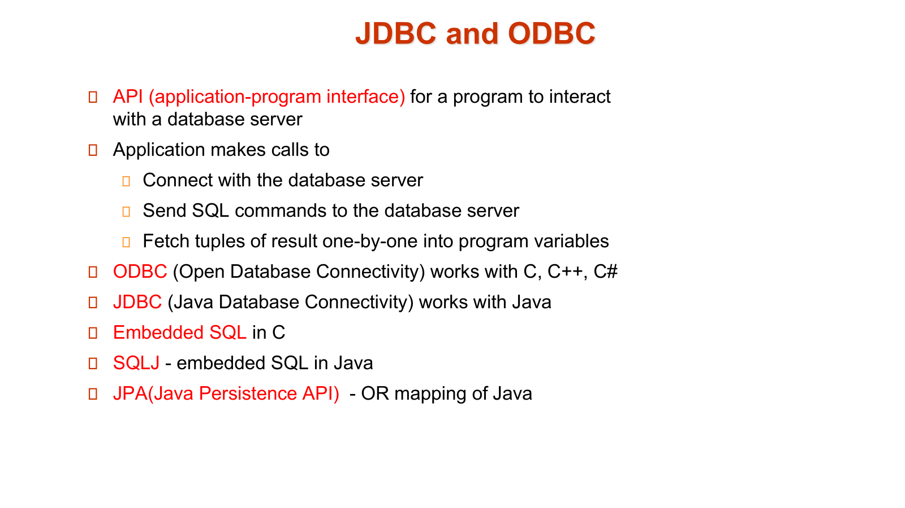

**接下来的都去看PPT吧，不是很有整理的必要**

#### 1.1.1 JDBC

#### 1.1.2 SQLJ

#### 1.1.3 ODBC

#### 1.1.4 Ebedded SQL

## 2 Procedural Constructs in SQL
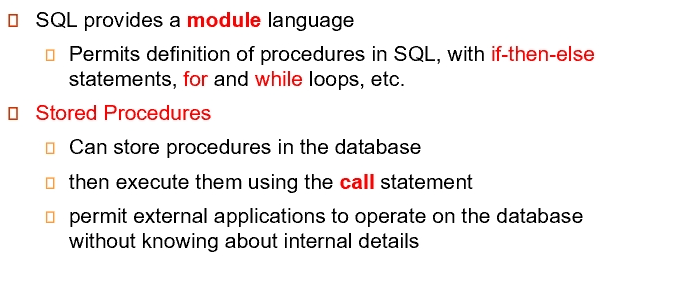

### 2.1 SQL Functions

??? example
    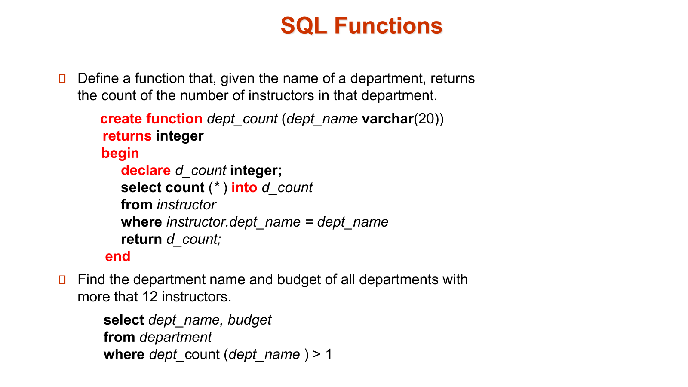

- Table Function

??? example
    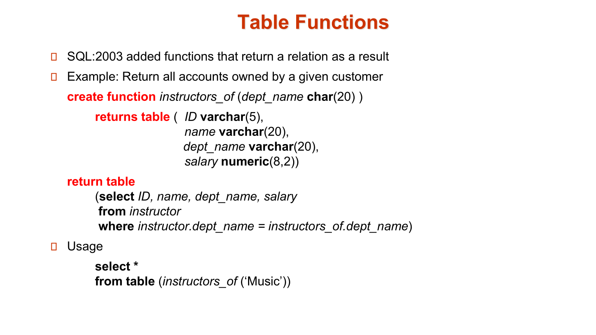

### 2.2 SQL procedures

??? example
    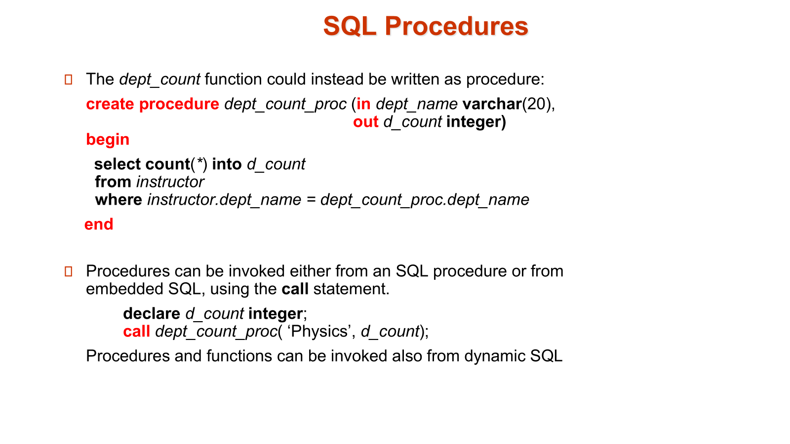

### 2.3 procedure constructs
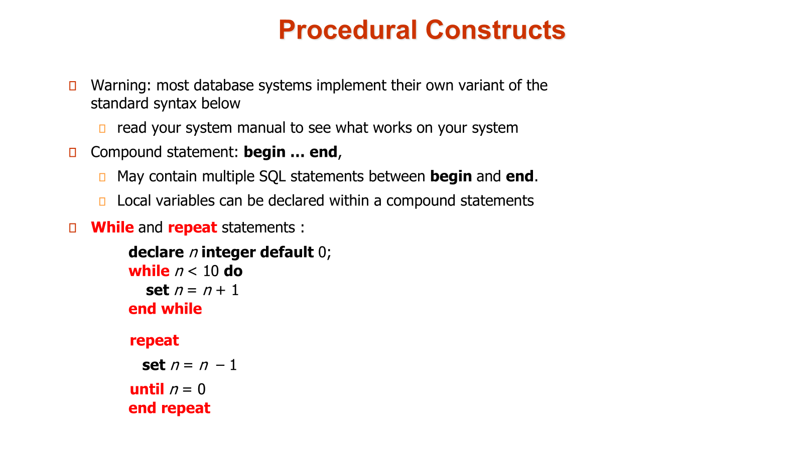

!!! note  "for loop"
    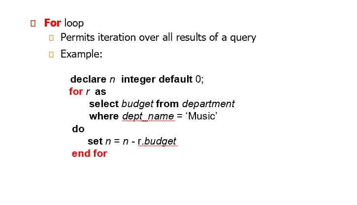
    r 表示返回的每一行

!!! note  "if-then-else"
    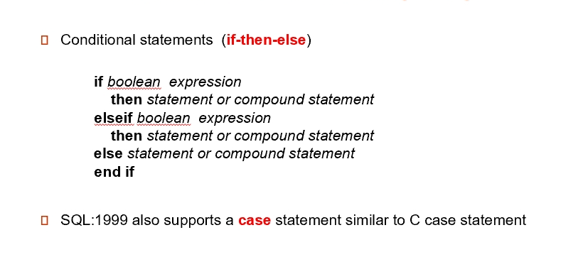

??? "big example"
    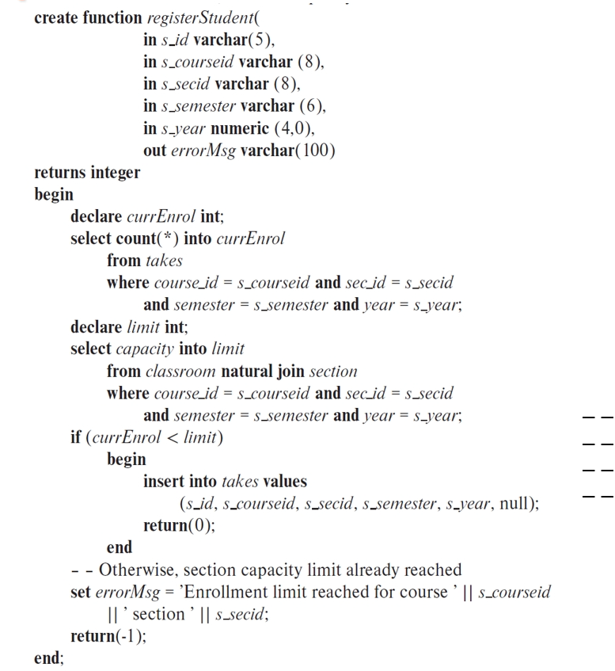

??? "external language"
    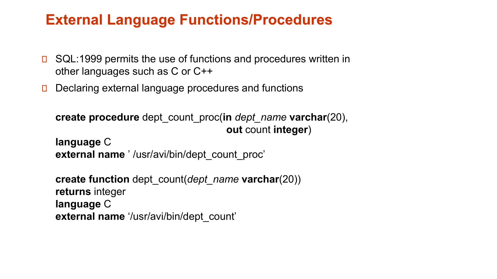
    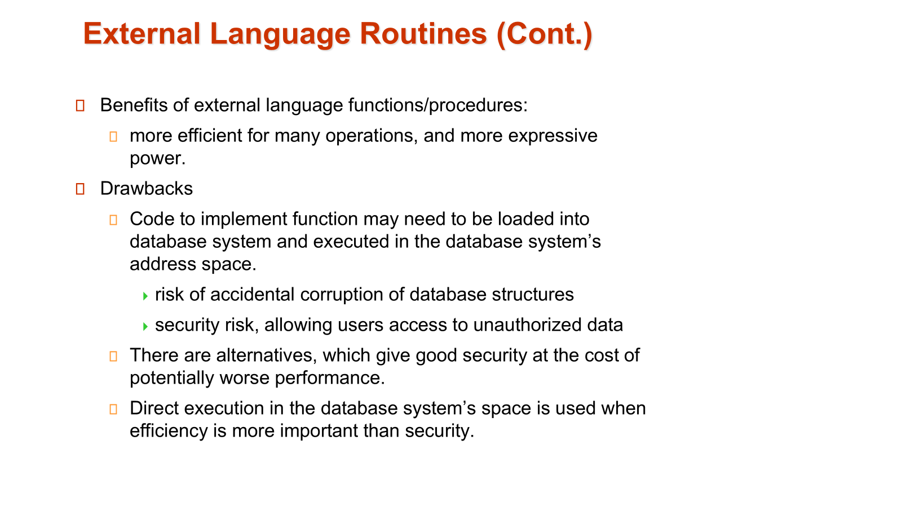
    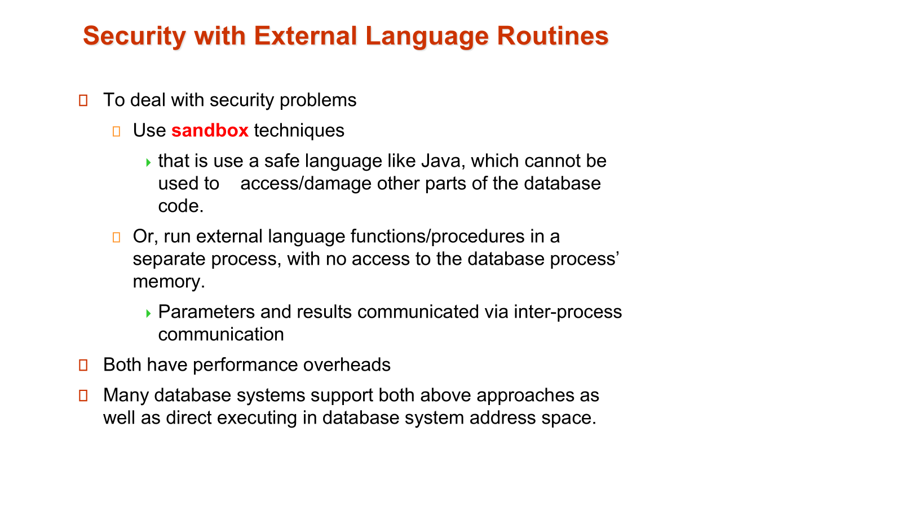

## 3 Triggers
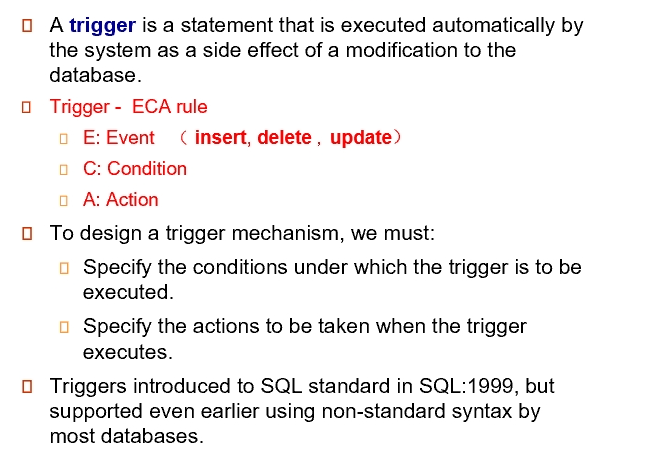

??? "example-account"
    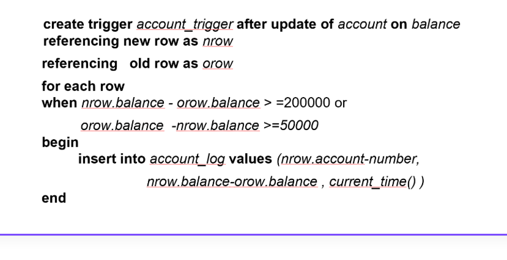

??? "example-time_slot_id"
    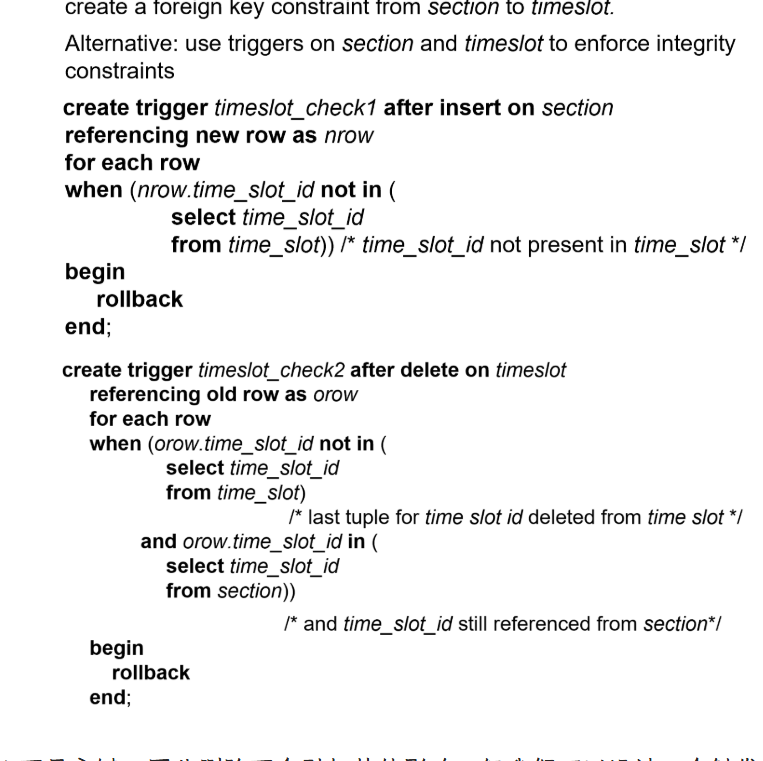
    - 当向 `section `表插入一行数据时，触发器会检查插入的` time_slot_id` 是否存在于 `time_slot` 表中。如果 `time_slot_id `不存在于 `time_slot` 表中，触发器会执行 `rollback`，撤销插入操作。如果 `time_slot_id` 存在于 `time_slot` 表中，插入操作会正常完成。
    - 当从` time_slot` 表删除一行数据时，触发器会检查被删除的 `time_slot_id` 是否仍然存在于 `section `表中。如果` time_slot_id` 仍然存在于 `section` 表中，触发器会执行` rollback`，撤销删除操作。如果 `time_slot_id` 不再存在于` section` 表中，删除操作会正常完成。

!!! tip
    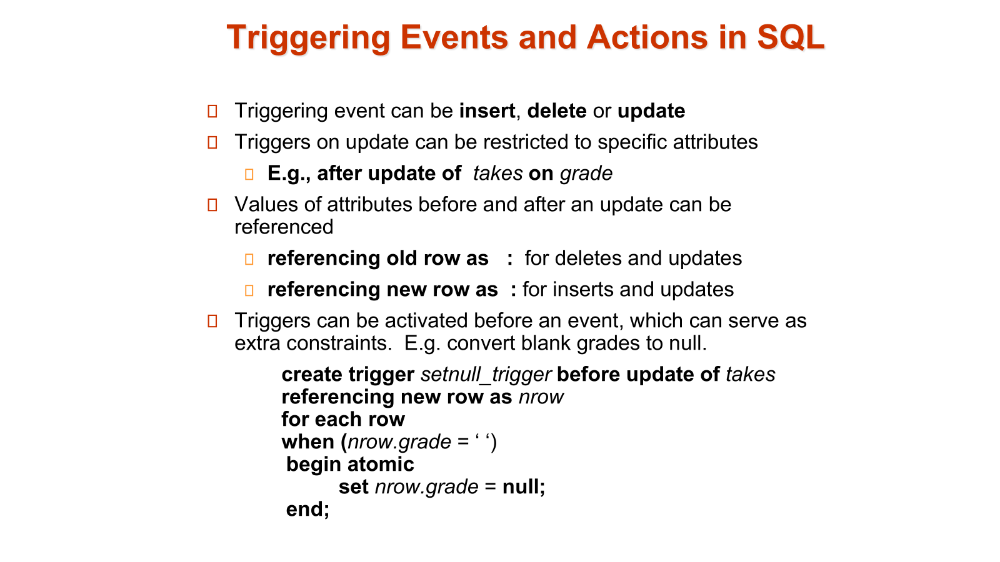

??? example "Trigger-Credits_earned value"
    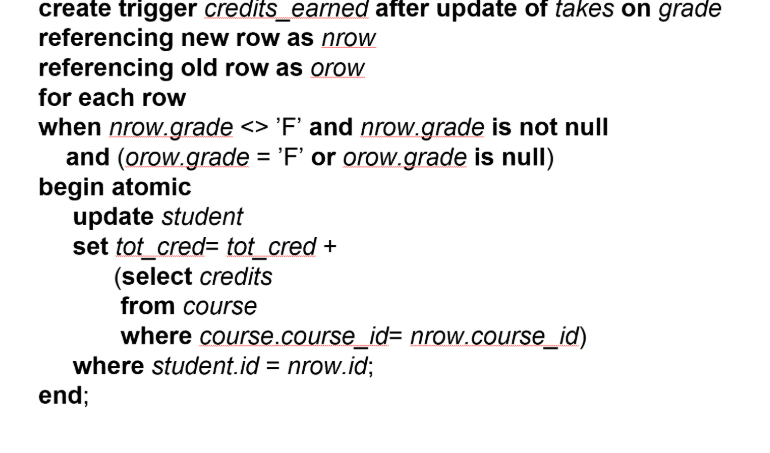
    如果本来挂科或没有成绩，更新之后，该课程不再挂科而且有成绩，就把学分加上去。

!!! note  "statement level triggers"
    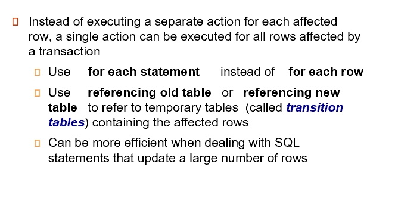
    可以对受事务影响的所有行执行单个操作，而不是对每个受影响的行执行单独的操作

??? "example"
    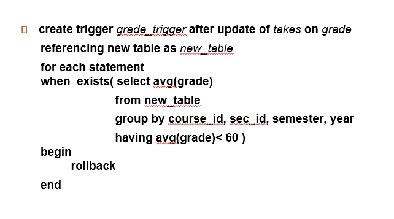
    当更新 takes 表的 grade 字段时，触发器会检查每个课程、章节、学期和年份的平均成绩是否低于 60。如果平均成绩低于 60，触发器会执行 rollback，撤销更新操作。如果平均成绩不低于 60，更新操作会正常完成。