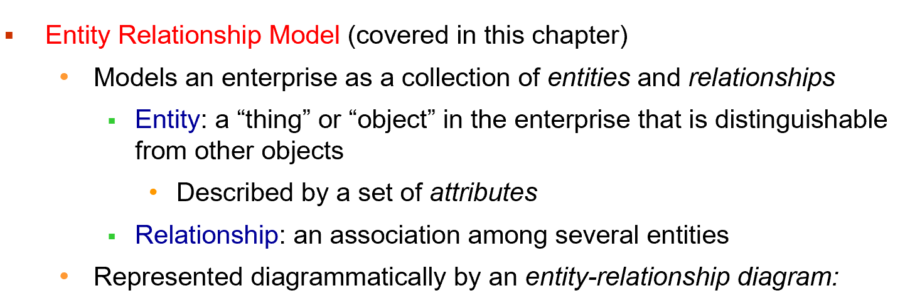
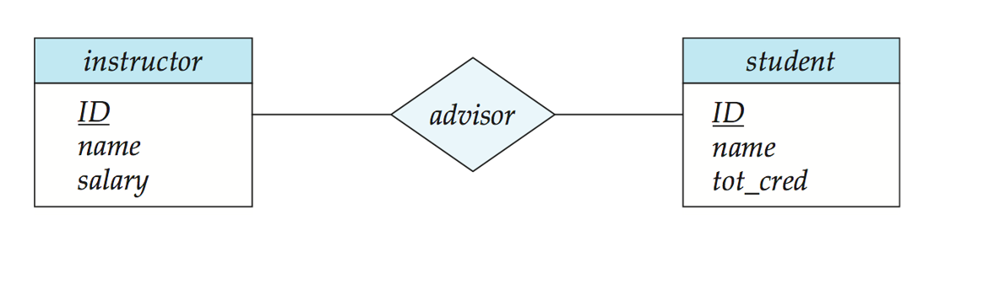
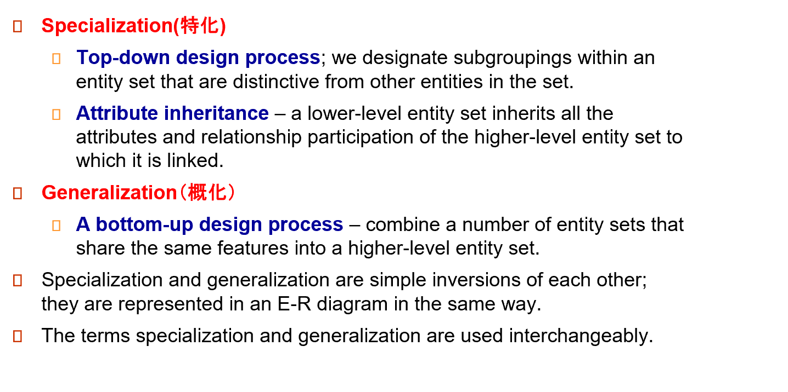

# Entity-Relationship Model




## 1 Example

- 一个方形框就是一个实体的集合，下面列出其属性。
- 实体与实体之间有关系，一个菱形框表示关系。
    - 一对一(<->)/一对多(<-)/多对一(->)。
    - 这里 `instructor` 实体里不需要 `dept` 属性，因为在 `department` 实体里有了，否则会`冗余`。
- 每个实体直接转换为关系模式。 关系转换为元组，元素为两个表的 `primary key`. 对于一对多的情况（如 `instructor` 和 `department`）转换后 `primary key` 仍为 `ID`.
- `为了减少表的数量，可以把 primary key 相同的表合并。`

- **双横线与单横线不同**
`双横线`表示每个对象都`必须`参与关系，而`单横线`则表示对象可以`不参与`关系。如 `inst_dept` 中如果 `department-inst_dep `为双横线，则表示每一个系都要有老师。
`有些联系是隐含的，如授课老师和听课的学生。`
`student和section之间都是单横线，因为在军训时，有课但学生还不选课即有学生不参与section`

- `section` 不足以唯一确定元组，称为`弱实体`，依赖于另一个实体`（如 OOP、DB 都可以有同样年份学期的 1 班）`。因为课程号` course_id` 放在 `section` 会有冗余，因此没有这个属性，导致形成了一个弱实体。` sec_course` 表示联系的是`弱实体（双框）`，section 不能离开 course 存在。

- `relationship` 上也可以带属性，如 takes 上的 grade.

- 关系双方可以是`相同的`实体集合，course 这里的 prereq 是多对多，表示一门课可以有多门预修课，一门课也可以是多门课的预修课。
- `{}` 里面是多个值，表示复合属性。这里表示 time_slot_id 实际上可以由这三个属性复合而成。

## 2 Database Modeling

A database can be modeled as:
- a collection of **entities**
- **relationship** among entities.

### 2.1 Entities


Entity sets can be represented graphically as follows:
- Rectangles represent entity sets.
- Attributes listed inside entity rectangle.
- Underline indicates primary key attributes.

??? example
    


### 2.2 Relationalship Sets

本质也是一个集合。最开始的例子中均为是二元联系，即是两个实体集合的关系，但是关系可以是多元的，即多个实体。如老师，同学，SRTP 项目可以共同形成一个关系。


??? example
    
    


##### 2.2.1 Relationship Sets with Attributes

An attribute can also be property of a relationship set.

**e.g.** The advisor relationship set between entity sets instructor and student may have the attribute `date` which tracks when the student started being associated with the advisor.

??? example
    
    


#### 2.2.2 Roles
Entity sets of a relationship need not be distinct.
Each occurrence of an entity set plays a “role” in the relationship.
The labels “course_id” and “prereq_id” are called **roles**.

??? example
    


#### 2.2.3 Degree(度) of a Relationship Set


??? example
    

### 2.3 Attributes
An entity is represented by a set of attributes, that is descriptive properties possessed by all members of an entity set.

**Attribute types**:

- **Simple（简单）** and **composite（复合）** attributes.
- **Single-valued（单值）** and **multivalued（多值）** attributes
    - **e.g.** multivalued attribute: `phone_numbers`
- **Derived（派生）** attributes
    - Can be computed from other attributes
    - **e.g.** age, given date_of_birth


??? example
    
    


### 2.4 Mapping Cardinality Constraints


??? example
    
    


??? example in E-R diagram
    
    
    
    


### 2.5 Total and Partial Participation
- **Total participation** (indicated by `double line`): every entity in the entity set participates in at least one relationship in the relationship set
所有元素都要参与关系
- **Partial participation**: some entities may not participate in any relationship in the relationship set


### 2.6 Notation for Expressing More Complex Constraints
A line may have an associated minimum and maximum cardinality, shown in the form l..h, where l is the minimum and h the maximum cardinality

- A minimum value of 1 indicates total participation.
- A maximum value of 1 indicates that the entity participates in at most one relationship
- A maximum value of `*` indicates no limit.

??? example
    

### 2.7 Primary Key
Primary keys provide a way to specify how entities and  relations are distinguished.  We will consider:
- Entity sets
- Relationship sets
- Weak entity sets

#### 2.7.1 Primary Key for Entity Sets


??? "翻译"
    - 根据定义，单个实体是不同的。
    - 从数据库的角度来看，它们之间的差异必须用它们的属性来表示。
    - 实体的属性值的值必须能够唯一地标识实体。
    - 实体集中的两个实体不允许对所有属性具有完全相同的值。
    - 实体的键是一组足以区分实体的属性


#### 2.7.2 Primary Key for Relational Sets


!!! note  "说人话"
    多元联系的 primary key 是两端 key 的组合。如果是一对一的联系，那么单个实体的 key 也可以作为 primary key. 一对多的联系（如导师和学生就是一对多，那么主键应该为学生）就是在many一端的实体的键


#### 2.7.3 Weak Entity Sets(弱实体集)
- An entity set that does `not` have a `primary key` is referred to as a **weak entity set**.
- The existence of a weak entity set depends on the existence of a **identifying entity set（标识性实体集）**
    - It must relate to the identifying entity set via a total, `one-to-many relationship set` from the identifying to the weak entity set
    - Identifying relationship（标识性联系） depicted using a double diamond
- The **discriminator(分辨符，or partial key)** of a weak entity set is the set of attributes that distinguishes among all the entities of a weak entity set when the identifying entity they depend is known.
- We underline the discriminator of a weak entity set with a dashed line. **（虚线）** 
- We put the identifying relationship of a weak entity in a double diamond. **（双框）**


??? example
    

!!! tip "Redundant Attributes"
    


## 3 Reduction to Relational Schemas
一个 ER 图可以转换成多种模式（图数据库、面向对象、关系模式等）

- A **strong entity set** reduces to a schema with the same attributes course(course_id, title, credits)
- A **weak entity set** becomes a table that includes a column for the primary key of the identifying strong entity set.

`Primary key of the table` is the union of the `discriminator of the weak entity set` and  the `primary key of the identifying strong entity set`. 
标识集合的主键加上弱实体集的分辨符。
    - section(course_id, sec_id, semester, year)
- A many-to-many relationship set is represented as a schema with attributes for the primary keys of the two participating entity sets, and any descriptive attributes of the relationship set. 即两个集合的主键拼起来，加上关系的附带属性。
- **Many-to-one and one-to-many relationship sets** that are total on the many-side can be represented by adding an extra attribute to the “many” side, containing the primary key of the “one” side.
多对一可以不转换为单独的关系模式，直接在“多“那个表上添加”一“的主键即可。

??? example
    

??? example
    
    - inst_dept 本质就是将 instructor 和 department 合并，在 instrutor 的属性上添加 dept_name.
    - 各有利弊，第一种写法表可能会太多，第二种写法合在一起表可能太大，不利于管理。


### 3.1 Composite and Multivalued Attributes
Composite attributes are flattened out by creating a separate attribute for each component attribute.

就像在 C 语言里定义一个结构。但是关系数据库里每个属性都必须是简单数据类型，就必须把这些复合属性铺平。

```SQL
instructor(ID, 
        first_name, middle_initial, last_name,      
        street_number, street_name, apt_number, 
        city, state, zip_code, date_of_birth, age)
```

A `multivalued attribute M` of an `entity E` is represented by a `separate schema EM`.

`Schema EM` has attributes corresponding to the primary key of E and an attribute corresponding to `multivalued attribute M`.
就是新建立个方案关系schema

??? example
    

!!! warning
    


## 4 Design issues

### 4.1 Common Mistakes in E-R Diagrams

- 信息冗余(student 的 dept_name 应该去掉)
  
- 关系属性使用不当(一门课可能有很多次作业，不能只用一个实体)
  
- 解决办法：
  

### 4.2 Use of entity sets vs. attributes


- 第一种方法，明确放一个电话号码。
- 第二种方法，电话号码可以附属更多属性，一个电话号码可以由多人共享。（如办公室的公共电话）


### 4.3 Use of entity sets vs. relationship sets
Possible guideline is to designate a relationship set to describe an action that occurs between entities.


!!! tip "说人话"
    实体可以便于与其他实体建立联系。
    如电商，我们可以简单的把客户和商品用 buy 联系起来，但后续还会有付款、物流等情况，我们最好把 buy 实体化为订单。


### 4.4 Placement of relationship attributes
e.g., attribute date as attribute of access or as attribute of account

- 第一种方法，可以记录每次访问的访问日期。
- 第二种方法，只能记录用户最近一次访问日期，不完整。


### 4.5 Binary Vs. Non-Binary Relationships

- **Binary versus n-ary relationship sets**
Although it is possible to replace any nonbinary (n-ary, for n>2) relationship set by a number of distinct binary relationship sets, a n-ary relationship set shows more clearly that several entities participate in a single relationship.尽管可以用若干不同的二元关系集替换任何非二元（n-ary, for n>2）关系集，但n-ary关系集更清楚地表明多个实体参与单个关系。

- Some relationships that appear to be non-binary may be better represented using binary relationships **e.g.** A ternary relationship parents, relating a child to his/her father and mother, is best replaced by two binary relationships, father and mother Using two binary relationships allows partial information (**e.g.** , only mother being know) But there are some relationships that are naturally non-binary **e.g.** : proj_guide
一些看似非二进制的关系可以用二进制关系更好地表示，例如，三元关系父母，将孩子与他/她的父亲和母亲联系起来，最好用两个二进制关系，父亲和母亲代替。使用两个二进制关系允许部分信息（例如，只知道母亲），但也有一些关系自然是非二进制的，例如：proj_guide

??? example "Converting Non-Binary Relationships"
    


## 5 Extended ER Features



未完待续