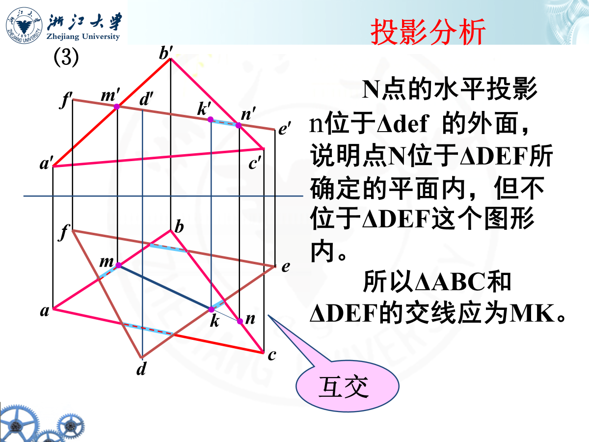

# chapter2 平面的投影

!!! note "投影垂直面"
    
    
    

!!! note "投影水平面"
    
    
    

!!! note "一般位置平面"
    

??? "一道值得思考的例题"
    
    最终答案是2种情况，斜向右下方的45度角方向也是可以的，画不下了，但是真实能够存在的。

??? "2道例题"
    
    答案当然是无穷多个啦~
    
    这个不难
    
    

??? "两道还可以的例题"
    
    
    例三有趣，自己动手画画，就不给答案了

# 直线与平面的相对位置关系

## 平行问题

### 直线与平面平行

??? "三个例子"
    
    
    

### 两平面平行

??? "几道例题"
    
    
    

## 相交问题

### 直线与平面相交

!!! note "例题两道"
    平面处于特殊位置
    
    直线处于特殊位置
    

!!! tip
    总结一下，从特殊视图入手，在普通视图中找到交线或交点，再从普通视图的积聚点入手，转移到特殊视图中的相关点，判断谁能被看到，谁不能被看到。

### 两平面相交

??? "两个例子"
    
    
    
    
    
    

!!! tip
    小结一下
    

# 两平面的相对位置关系

